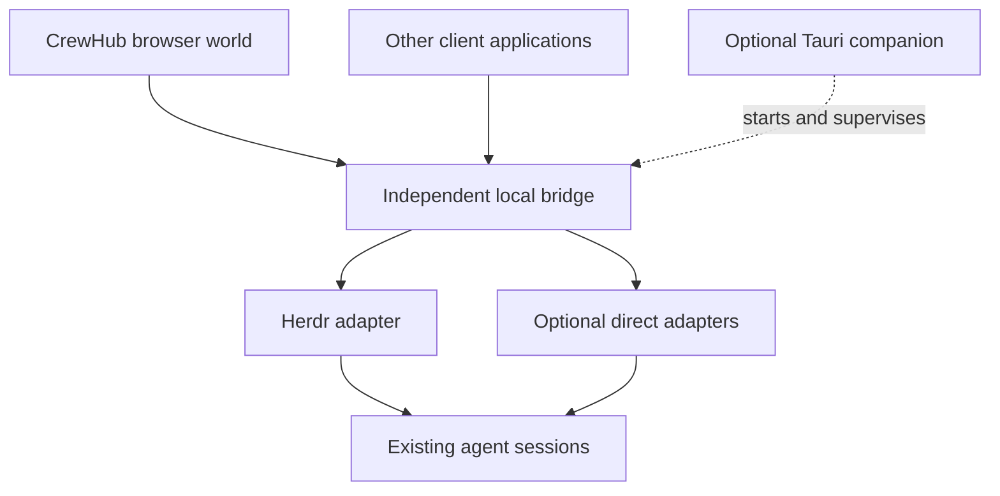

# Architecture

## Decision

Keep the visual experience browser-first and the machine bridge independently
usable. Tauri is an optional packaging and desktop-integration layer. It does not
own the visual design or define the public bridge API.

The browser room, headless grid engine, and draft session types are implemented.
The accepted next direction adds CrewHub-owned towns, dynamic rooms, and bindings
to runtime sessions. See [the town plan](TOWN_PLAN.md) and
[the identity decision](decisions/0003-towns-and-session-bindings.md). Those additions
remain planned. The user's forthcoming design system will guide UI refinement.
The following diagram describes future live integration, not running services.

## Boundaries

| Layer | Owns | Must stay independent of |
| --- | --- | --- |
| World | Scene, characters, input, view state, accessible alternatives | Tauri APIs, process control, provider credentials |
| World engine | Grid, footprints, placement, pathfinding, movement, semantics | React, Three.js, bridge and runtime details |
| Bridge | Discovery, normalized events, explicit command routing, local pairing | A particular UI or desktop window |
| Adapter | One runtime's discovery and control interface | Rendering decisions |
| Protocol | Versioned snapshots, events, capabilities, command outcomes | React, Three.js, Rust implementation details |
| Tauri companion | Installation, lifecycle, tray, notifications, optional window | Exclusive ownership of bridge functionality |

React, TypeScript, and Vite host the browser app. Three.js is lazy-loaded for the
room; an imperative scene controller owns frame updates outside React. React owns
the accessible controls and oversight panel. The renderer consumes the same grid
used for prop placement and navigation; see [GRID_ENGINE.md](GRID_ENGINE.md).
No React Three Fiber or physics engine is needed for this slice.

Rust is the intended bridge starting point; its
crate structure and server library remain undecided until the bridge milestone.

## Integration order

1. Normalize mock identities and bindings; build growing rooms and a mock town.
2. Herdr observation: discover existing sessions and follow status events.
3. Direct Claude Code and Codex observation, each gated by proof of existing-session
   visibility through supported interfaces.
4. Explicit supported interactions with one verified target and command route.
5. Optional Tauri packaging, remote access, and other clients.

Browser clients cannot directly open Herdr's Unix domain socket or Windows named
pipe. The bridge provides that local access. Its initial browser interface is
intended to use authenticated HTTP for commands and WebSocket for events; exact
routes, pairing, and schemas are design work for the live milestone.

## Session identity and command ownership

A persistent character, a native runtime session, and a task are distinct things.
A character can outlive a session; one session can work on several tasks.

Namespace identities by bridge and runtime. Keep native session references when
available, and account for pane occupant replacement. A Herdr pane identifier alone
is not a permanent agent identity. If the same native session appears through
Herdr and a direct adapter, reconcile it and select one command route. Do not
resume or control it concurrently through two providers.

Advertise actual capabilities per session. Unsupported controls remain unavailable.
A submitted prompt is not a completed task. Unknown, idle, disconnected, waiting
for permission, and successful completion must not collapse into the same state.
Keep runtime approval policy authoritative; normal prompting is not approval.

## Events and reconnection

At Herdr connection time, subscribe and await acknowledgement before taking
`session.snapshot`, buffer intervening events, and reconcile in order. Obtain a
fresh snapshot after reconnect because subscriptions do not replay old events.
Before implementation, verify these details against the installed Herdr version.

The CrewHub protocol must define its own stream epoch/revision behavior before
live use. Include bridge identity, protocol version, and explicit connection
state. Validate messages at runtime, bound buffers, and recover from gaps with a
snapshot. Keep rendering independent of event frequency.

## Local access and reuse

Default to loopback and explicit client pairing. Authenticate clients, check
allowed browser origins, and validate command targets. Never put provider secrets
in frontend bundles, URLs, or browser storage. Reusing the bridge must not require
opening arbitrary machine commands to any website.

Remote access, including use across Tailscale, requires an explicit supported
deployment path, authentication, and origin handling. A static site or an HTTPS
page does not automatically gain localhost or private-network access. That work
is outside the bootstrap and first room.

## Primary references

- [Herdr socket API](https://herdr.dev/docs/socket-api/)
- [Tauri architecture](https://v2.tauri.app/concept/architecture/)
- [Codex App Server](https://learn.chatgpt.com/docs/app-server)
- [Claude Code SDK sessions](https://code.claude.com/docs/en/agent-sdk/sessions)
- [OpenAI MCP integrations](https://developers.openai.com/api/docs/mcp)

Reviewed for the bootstrap on 2026-09-12. Recheck relevant APIs before implementing
an adapter. MCP exposes tools; it does not by itself mirror a user's chat history.
