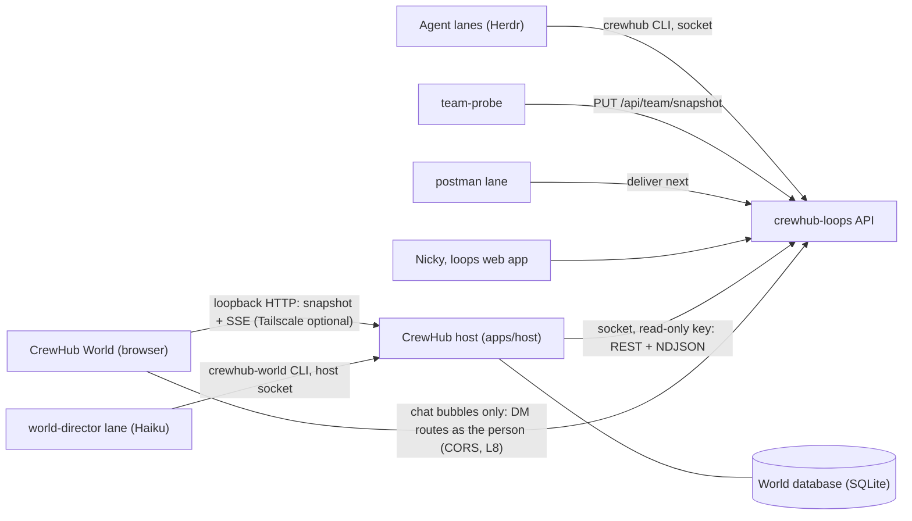

# Architecture

## Decision

CrewHub World is a browser world served by a small CrewHub host that reads
crewhub-loops. There is no bridge and no Tauri. The decision is
[ADR 0005](decisions/0005-crewhub-world-on-loops.md) and the full plan is
[LOOPS_INTEGRATION_PLAN.md](LOOPS_INTEGRATION_PLAN.md).

Towns and rooms are CrewHub's own; every fact is crewhub-loops'. See
[the town plan](TOWN_PLAN.md) for the layout model, with the runtime-binding parts
superseded. The [design system](DESIGN_SYSTEM.md) supplies the UI tokens and
components.

**The diagram below is the target, not running services.** Only the browser world and
a scripted demo source are built; see "What is built (demo mode)" after it.


```mermaid
flowchart LR
  Agents["Agent lanes (Herdr)"] -- "crewhub CLI, socket" --> Loops["crewhub-loops API"]
  Probe["team-probe"] -- "PUT /api/team/snapshot" --> Loops
  Postman["postman lane"] -- "deliver next" --> Loops
  People["Nicky, loops web app"] --> Loops
  Host["CrewHub host (apps/host)"] -- "socket, read-only key: REST + NDJSON" --> Loops
  Host --- DB[("World database (SQLite)")]
  Browser["CrewHub World (browser)"] -- "loopback HTTP: snapshot + SSE (Tailscale optional)" --> Host
  Browser -- "chat bubbles only: DM routes as the person (CORS, L8)" --> Loops
  Director["world-director lane (Haiku)"] -- "crewhub-world CLI, host socket" --> Host
```

## What is built (demo mode)

Tonight the world runs only in the browser on a scripted source. There is no
`apps/host`, no network call to crewhub-loops and no model call.

| Package | Role |
| --- | --- |
| `packages/loops-client` | crewhub-loops types, hand-written runtime validators, the event allowlist, and the `WorldSource` seam |
| `packages/demo` | `DemoSource`: a deterministic, in-memory crewhub-loops with a 16-minute storyline, playback controls and the chat API the bubbles call |
| `packages/world-model` | Projection, `reduceWorld`, `describeWorld` (text view), town document, catalogue, director intents and `where` |
| `packages/world-engine` | Grid, footprints, placement, pathfinding, the prop format (`crewhub-prop/1`) and its validator |
| `apps/world` | The browser app: Three.js town and building scenes, the minimal UI, the chat bubbles mirrored from crewhub-loops, the `useWorld` seam |

Data flow:

```text
DemoSource -> Projection -> reduceWorld -> renderer / describeWorld
```

`DemoSource` emits loops-shaped envelopes with increasing `seq`. The projection
applies them idempotently. `reduceWorld` maps facts to buildings, rooms, work
objects and agent placements. The renderer and the text description read only that
model, so a future host source replaces `DemoSource` and nothing else changes.

Phase status, each to be confirmed at the end of the night:

- Phase 1 (town, loops-client, demo source): built in demo mode
- Phase 2 (chat mirror, backed by the demo chat API): built in demo mode
- Phase 3 (interiors, ticket drone): built in demo mode
- Phase 4 (town paths and dynamic pathfinding): built in demo mode
- Phase 5 (town document and build mode): built in demo mode
- Phase 6 (scripted director and `where`): built in demo mode

## World styles

The Greenhouse look is the first registered `WorldStyle` (`packages/world-style` is the
contract, `packages/style-greenhouse` the implementation, `apps/world/src/world/style.ts`
the only importer). Renderers ask a style for a mesh by semantic key and never import
its models; a test enforces that boundary. Styles resolve per building (a plot style id,
falling back to the town default). Semantics (footprints, room roles) stay in the world
model and the grid engine. The contract is described in [WORLD_STYLES.md](WORLD_STYLES.md).
Built: the seam, the registry and the Greenhouse style. Not built: a second style,
external loading, an editor.

## Boundaries

| Layer | Owns | Must stay independent of |
| --- | --- | --- |
| World | Scene, characters, input, view state, accessible alternatives | Process control, credentials, runtime details |
| World engine | Grid, footprints, placement, pathfinding, movement, semantics | React, Three.js, host and runtime details |
| Host (planned) | Reading crewhub-loops with a read-only key, the world database, serving and pairing the browser | Rendering, movement, agent control, provider secrets |
| loops client | crewhub-loops types, runtime validation of every response and event, the `WorldSource` seam | React, Three.js, the DOM, the network |
| crewhub-loops (external) | Every fact: projects, tickets, agents, deliveries, messages, team presence | CrewHub's code; it is read, never edited |

React, TypeScript, and Vite host the browser app. Three.js is lazy-loaded for the
town; an imperative scene controller owns frame updates outside React. React owns
the accessible controls, the chat bubbles and the text view. The renderer consumes the same grid
used for prop placement and navigation; see [GRID_ENGINE.md](GRID_ENGINE.md).
No React Three Fiber or physics engine is needed for this slice.

## Integration order

The phases of plan section 10 are listed in [the roadmap](ROADMAP.md). The demo phases
come first; the host phases stay open.

The host would reach crewhub-loops over its Unix socket; browsers reach the host over
loopback HTTP and SSE (plan section 3). Browsers cannot open a Unix socket.

## Identity and commands

Identity is the loops principal id; a worker's identity is its session and name. The
host sends no commands. The chat bubbles send DMs as the person through loops' own
routes (in demo mode, an in-browser fake answers them and the reply is scripted).
Everything else a person does opens the loops web app.

Unknown, idle, blocked and done are different lane statuses, and a lane status never
proves that a task succeeded. A team snapshot older than 5 minutes is shown as
unknown.

## Events and reconnection

The loops stream contract: resume with `lastSeq`, the server ends a stream after
300 s, heartbeats carry a seq, and a 410 means reload. The demo source emits the same
envelopes and heartbeats. Validate every response and event at runtime, bound
buffers, and keep rendering independent of event frequency.

## Local access (planned)

Both apps on one machine by default: loopback, a one-time pairing link, an HttpOnly
cookie, Host and Origin checks. Tailscale or another TLS proxy is only an option.
Nothing of this exists in demo mode, and no credential is ever bundled.

## Primary references

- `loops:docs/integrators/events.md`
- `loops:docs/integrators/team-and-projects.md`
- `loops:docs/integrators/agents-and-states.md`
- `loops:docs/integrators/read-model.md`

`loops:` is the crewhub-loops repository, commit `a1bed0f`.
