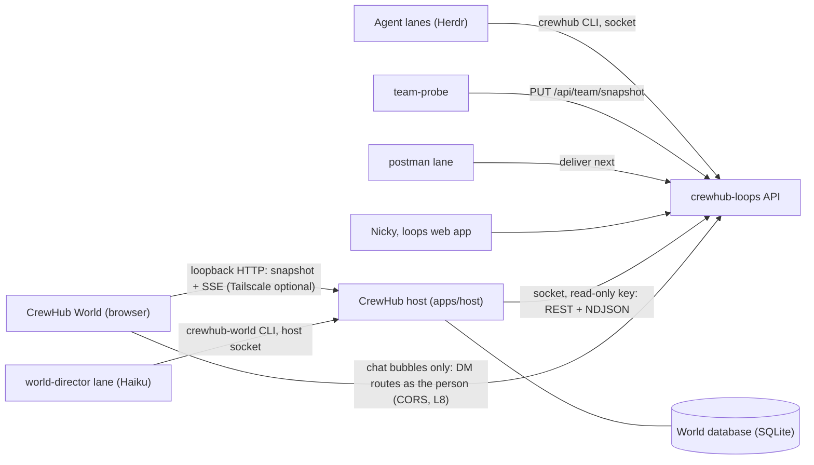

# CrewHub World on crewhub-loops: integration plan

Status: proposal, revised the same day after Nicky's answers to the first
round of open questions (2026-09-30). This document changes no code. The
decision record is [ADR 0005](decisions/0005-crewhub-world-on-loops.md).

Citations: `loops:<path>` is a file in the crewhub-loops repository at commit
`79ecfa0`. `loops:.../` abbreviates `loops:services/api/src/crewhub_loops/`.
`v1:<path>` is a file in the CrewHub v1 repository (`crewhub`). Plain paths are
in this repository. The loops and v1 files are cited as code spans, not links,
because they live in other repositories. This repository (crewhub2) will be
renamed crewhub later; the plan says CrewHub throughout.

## 1. Summary and decision

crewhub-loops becomes the system of record and the driver for everything about
projects, tickets, agents, how agents work, how they talk to each other and how
people talk to them. CrewHub becomes **CrewHub World**. It has two parts:

- **The CrewHub host** (`apps/host`), one small process next to crewhub-loops.
  - It reads crewhub-loops over its Unix socket with its own read-only agent key,
    using the same HTTP contract the `crewhub` CLI uses.
  - It keeps the world's own database.
  - It serves the world to the browser.
- **The browser world**, which renders everything and runs the movement. Its
  visible UI is minimal: the loops chat bubbles, navigation, and a build mode.
  Everything else is expressed in the 3D world or opened in the loops web app
  (section 4.7).

The world model:

- Every project is a building.
- Inside a building, agents and work have separate rooms:
  - Agents sit in rooms by role, from a predefined catalogue: the lead's office
    at the centre, then a workers room, an analyst room and a design room.
  - Tickets are physical objects (folders, boxes, crates, envelopes by `kind`)
    that move through rooms by status, so the review room visibly piles up.
- An agent that belongs to several buildings is one real avatar in the building
  where it works now, with visible proxies everywhere else.

CrewHub's own work is dynamic pathfinding, a faithful visual language for every
crewhub-loops fact, and props, including props people make themselves. The
bridge, the adapters, the session protocol and the Herdr-first direction are
removed.

Presentation is deterministic by default. A dedicated Haiku director lane,
built on the postman pattern, may plan idle movement every 5 minutes and after
events. It is switchable and capped, and its usage is monitored.

### Decisions taken (Nicky, 2026-09-30)

| Question | Answer | Where it lands |
| --- | --- | --- |
| Serve the world from crewhub-loops (`/world/`)? | No. Use the CLI and socket path instead; nothing is served by crewhub-loops. | Section 3 |
| Rooms by ticket status or by milestone? | Rooms by agent role (lead's office, workers, analyst, design) from a predefined catalogue, combined with a room per status where boxes and files move and pile up; the ticket kind sets the object's look. Confirmed. | Section 4.2 |
| Are people shown? | No. The world shows only agent avatars for now. A person appears only as a name on the boxes that wait for them. | Sections 4.2 and 4.5 |
| Role catalogue and name rules? | Accepted; recheck once crewhub-loops documents agent roles. | Section 4.2 |
| Which agent is "the main agent"? | The agent flagged `is_crewhub_lead`. crewhub-loops already pins it by default (`loops:.../domain/dm.py:357-371`). | Section 4.7 |
| Local-only layout storage for now? | A proper local database holds all world information. | Sections 3 and 6 |
| Can one agent belong to several buildings? | Yes. Either clone it visually, or keep one real agent with proxies, the real one where it is actively working. The plan takes the second. | Section 4.4 |
| AI movement? | Yes, on Haiku or another very cheap model, planning every 5 minutes or after actions. Measure the cost of one Haiku and adapt. Postman suggested as its home. | Section 7 |
| Deployment? | By default crewhub-loops and CrewHub run on the same machine. Tailscale is always optional. | Section 3.5 |
| A world without DMs (the host reads as an agent)? | Accepted for the scene; superseded for chat by the next row. L5 stays optional. | Sections 3.1 and 9 |
| How much UI? | As little as possible; let the 3D world be the 3D world. Initially only: the chat bubbles, an exact mirror of the loops chat (a hard requirement; by default just the `is_crewhub_lead` agent), navigation of the world and its buildings, and a minimal build mode for placing props. Details are looked up in the loops web app. | Sections 3.5 and 4.7 |
| The director in its own Haiku lane rather than inside postman? | Agreed: a dedicated `world-director` lane on the postman pattern. | Section 7.3 |

## 2. What crewhub-loops is today

crewhub-loops is "the next-level inbox and ticketing for the ekinsol agent teams"
(`loops:README.md`). It is a FastAPI service with a React web app, SQLite and one
append-only event log. Agents reach it through a single-file CLI. A postman lane
(Claude Code on Haiku, `loops:docs/postman-briefing.md`) forwards deliveries into
agents' Herdr panes.

### 2.1 Domain model

| Entity | Key facts | Source |
| --- | --- | --- |
| Project | `slug`, `key` (ticket prefix), `name`, `lead` (one principal), `herdrSession`, `color`, `icon`, `counts` per status, `assigneeCounts`, archive state, root/extra folders, per-project features (`releases`, `milestones`, `watchdog_nudge`) | `loops:services/api/src/crewhub_loops/contracts/projects.py:39`, `domain/features.py:30` |
| Ticket | `key`, `title`, `kind` (task, feature, bug, question), `status` (backlog, planned, in_progress, review, done), `priority`, `assignee`, `waitingOn`, labels, `agentWorking`, `stall`, `waitingOnHuman`, `milestone`, `held`, `blocked`, `blockedBy`/`blocking`, `statusChangedAt`, archive and release refs | `loops:.../contracts/common.py:10`, `contracts/tickets.py:84-140` |
| Comment | threaded (`parentId`), by people or agents, `normal` or `system`; a person's comment on a Review ticket they wait on moves it back to In progress | `loops:docs/agents.md` ("Finishing a ticket"), `domain/comments.py:137` |
| Progress line | short status line on a ticket (`start`, `update`, `done`, `question`), source `herdr` (probe reads the pane status line every 30 s) or `cli`; rate-limited; workers write under their lead | `loops:docs/agents.md` ("Show progress"), `contracts/progress.py:10-35` |
| Milestone | per-project feature; `key` (`CL-M3`), `state` (planned, active, done, cancelled), `targetDate`, `owner`; hand-off to an agent creates one delivery per ticket | `loops:.../contracts/milestones.py:49-80`, `docs/agents.md` ("Milestones") |
| Release | per-project feature; draft made by a person, notes and tag by the lead, published only after a person's request; has a carrier ticket | `loops:docs/agents.md` ("Releases"), `docs/events.md` (CL-21) |
| Principal | `user` (person: admin or member), `agent` (role `lead`, `router`, `probe`) or `system` | `loops:.../contracts/common.py:14-18` |
| Agent | registered principal with `herdrSession`, `disabled`, `lastSeenAt`; with the global `agents_admin` feature also lanes, desired/observed model and effort, projects led and joined | `loops:.../contracts/auth.py:102`, `contracts/agents.py:22-100` |
| Worker | not registered: any Herdr agent `<stem>-<x>` in the session of the registered `<stem>-lead`; appears only in the team snapshot | `loops:docs/agents.md`, `docs/team.md` ("Lanes and workers") |
| Team snapshot | every Herdr session and agent with `status` (working, idle, done, blocked, unknown), `contextLine`, `paneId`, `lead`, `unsentInput`; pushed by `team-probe` every 30 s | `loops:docs/team.md`, `contracts/team.py` |
| Delivery | an event that concerns a principal becomes a delivery (`pending`, `claimed`, `forwarded`, `uncertain`, `unroutable`, `obsolete`), forwarded by postman as one line | `loops:.../contracts/common.py:19`, `docs/postman-briefing.md` |
| DM | a thread between a person (admin) and one agent; messages `queued`, `delivered`, `answered` | `loops:.../contracts/dm.py`, `api/routers/dm.py:69` |
| Watchdog state | per in-progress ticket: `stalled` (nobody attends it and nothing happened) or `attention` (nobody working and a lane blocked); "waiting on a human" suppresses it; modes `off`, `observe` (default), `nudge` | `loops:.../domain/watchdog.py:1-60`, `docs/deploy.md` ("Stall watchdog"), `contracts/tickets.py:41` |
| Link, attachment, label | typed links (GitHub PR, Linear, URL), attachments up to 20 MiB, project or global labels (`awaiting-deploy`, `release`, `smoke` reserved) | `loops:docs/agents.md` ("Ticket etiquette") |

### 2.2 Events and the stream

- One log, one envelope: `{v:1, seq, ts, type, project:{slug,key}|null,
  ticket:{id,key,title}|null, actor:{id,kind}, recipientIds, payload}`. Payloads
  carry ids and counts, never credentials or bodies (`loops:docs/events.md`).
  The ticket title is joined into the envelope (`loops:.../api/stream.py:127`).
- 49 event types, validated on the query (`loops:.../contracts/events.py`).
  The viewer-relevant ones are listed in 2.4.
- `GET /api/events?after=N` returns `{events, lastSeq}`. `GET /api/events/stream`
  is NDJSON. Without `after` it starts live at the tail. With `after=N` it replays
  `seq > N` and then goes live. There is a heartbeat every 15 s whose `seq` never
  runs ahead. The server ends every stream after 300 s and the client reconnects
  with the last seq. There is a cap of 4 streams per principal and 64 in total
  (429 otherwise). Credentials are revalidated every 60 s. A future retention
  limit will answer 410 `cursor_expired` (`loops:docs/events.md`).
- Filters: `project`, `types`, `for=me`. Visibility is enforced server-side:
  DM events reach only the thread's agent and admins, and agent-action events
  reach only participants and admins (`loops:.../api/stream.py:142-180`).
- `team.updated` has an empty payload. The client re-reads `GET /api/team`, and
  should poll it at least every 30 s (`loops:docs/team.md`).
- The loops web app already implements a follower in TypeScript: NDJSON parser,
  reconnect with `after`, 410 resync and a polling fallback
  (`loops:apps/web/src/api/stream.ts`). The CrewHub host copies that pattern.

### 2.3 Auth, transports and the CLI

- One app, two listeners: a Unix socket (mode 0600) and TCP. TCP is exposed only
  through nginx at `127.0.0.1:8091/api`, and, in the current omarchy deploy, optionally behind Tailscale Serve
  on port 9443 (`loops:docs/events.md`, `docs/deploy.md`).
- Principals come from the `chl_session` cookie (people; `SameSite=Lax`, path `/`)
  or `Authorization: Bearer chl_…` (agents). A valid key together with a cookie is
  refused (`loops:.../auth/deps.py:78-120`, `api/routers/auth.py:159-194`).
- A host/Origin guard checks both headers against `CHL_ALLOWED_HOSTS` and
  `CHL_ALLOWED_ORIGINS`. There is **no CORS middleware**: a page on another origin
  gets no `Access-Control-Allow-*` headers (`loops:.../api/security.py:56-81`).
  Dev already allows `http://127.0.0.1:5173` (`loops:compose.dev.yaml:9`).
- The `probe` agent role may only read and PUT the team snapshot, inputs and
  runtime observations. There is no read-only role for any other client
  (`loops:.../auth/deps.py:139-172`).
- OpenAPI is switched off (`docs_url=None`, `openapi_url=None`,
  `loops:.../api/main.py:123-125`). Only the team snapshot has a published JSON
  schema (`loops:docs/team.schema.json`).
- The CLI `crewhub` (`loops:clients/crewhub.py`, stdlib only) is the agents'
  interface. It runs as one agent (`CREWHUB_AGENT`), reads a 0400 key file from
  `/etc/ekinsol/secrets/crewhub-loops/` on every call and speaks HTTP over the
  socket. Its read commands are agent-shaped: `me`, `queue`, `ticket show`,
  `ticket comments`, `project show SLUG`, `milestone list/show/tickets`,
  `release show/list`, `dm list/read`, and `watch --json` with a per-label cursor
  file. It has **no** command for the project list, the board, the team
  snapshot, the agent list or the watchdog (`loops:clients/crewhub.py`, subcommand
  list; `docs/events.md` "CLI").
- agentctl (`loops:clients/crewhub_agentctl.py`, `docs/agents-agentctl.md`) is the
  only code that starts, exits or restarts lanes. It works through Herdr under a
  fenced lease, and only for confirmed agent actions. It is not a viewer concern:
  the world sees its outcome as `team.updated` and `agent-action.updated`.

### 2.4 What a viewer needs

The host reads as an agent (section 3.5); "any principal" includes it.

| World need | Endpoint (initial load) | Events (live) | Who may read |
| --- | --- | --- | --- |
| Buildings | `GET /api/projects` | `project.created/updated/archived/restored/reordered` | any principal |
| Lead and members | `GET /api/projects/{slug}`, `GET /api/agents` | `agent` changes arrive as `team.updated` or project updates | any principal |
| Tickets per room | `GET /api/board/{slug}` (columns of cards) | `ticket.created/updated/moved/archived/unarchived` | any principal |
| One ticket's detail | `GET /api/tickets/{ref}`, `/comments`, `/progress` | `comment.*`, `link.*`, `attachment.added`, `ticket.progress` | any principal |
| Presence and posture | `GET /api/team` | `team.updated` (payload-free), plus polling every 30 s | any principal |
| Stalls | card `stall`, `GET /api/watchdog` | `ticket.stalled`, `ticket.resumed` | watchdog route: admin or agent |
| Deliveries | none for a person (`GET /api/deliveries` is router/operator only) | `delivery.created/updated` with `recipientIds` | any principal (envelope only) |
| DMs | `GET /api/dm/threads` | `dm.created`, `dm.answered` | admin or the thread's agent, so **not** the host's viewer key |
| Milestones, releases | `GET /api/projects/{slug}/milestones`, `/releases` | `milestone.*`, `release.*` | any principal, feature on |

## 3. Target architecture

### 3.1 Does crewhub-loops need to serve `/world/`?

No. A browser cannot open a Unix socket or run the CLI, so the socket path
needs a process on the same machine as crewhub-loops. The requirement for a proper
local world database needs a process anyway. Once that process exists, reading
crewhub-loops through it costs little, and it removes every crewhub-loops change
that the direct-browser option needed.

| Question | Host over the socket (chosen) | Browser reads loops directly (dropped) |
| --- | --- | --- |
| crewhub-loops changes | None to serve or sign in. A read-only role (L1) before production. | A `/world/` mount, a sign-in `next` path, and world storage on the server. |
| Credentials | One key file on the host, 0400, read per call like the CLI (`loops:clients/crewhub.py:114-123`). Never in the browser. | The person's session cookie. |
| Streams | One loops stream for every browser tab and the director (loops caps each principal at 4; `loops:docs/events.md`). | One stream per browser, shared across tabs. |
| World database, director, agent awareness | Live in the host. | Would need world storage and an endpoint in crewhub-loops. |
| Identity | The host is an agent. It sees what agents see, so no DM content and no DM events (`loops:.../api/stream.py:142-180`). The chat bubbles therefore talk to crewhub-loops as the person, directly from the browser (3.5); every other human action opens the loops web app. | The person: DMs visible, writes possible in the world. |
| Cost to CrewHub | A small service to run next to crewhub-loops, with its own pairing for the browser. | None beyond a client module. |
| Latency | Socket on the host (sub-millisecond) plus SSE on loopback. Comparable. | nginx on loopback. |

### 3.2 The host: the whole CrewHub shell

The host is Node 24 and TypeScript in this npm workspace. It shares
`packages/world-engine`, so layout edits and director intents are validated by
the same code the browser runs, and it shares `packages/loops-client` (the loops
types and runtime validation). It stores data in SQLite through Node's built-in
`node:sqlite`; its stability on Node 24 is checked in phase 1, with
`better-sqlite3` as the fallback.

| Responsibility | Detail |
| --- | --- |
| Read crewhub-loops | The Unix socket by default; loopback TCP (`127.0.0.1:8091/api` through the loops nginx, or `127.0.0.1:8000` under `make dev`) where the socket is not reachable, for example when a container runtime does not share Unix sockets with the host. Both transports need `Authorization: Bearer` the key, with key file checks like the CLI's (regular file, owned by the user, mode 0400, `O_NOFOLLOW`). The host does not shell out to `crewhub`, because the CLI has no command for the project list, the board, the team snapshot or the agent list (section 2.3). |
| Keep facts in memory only | A normalised projection keyed by loops ids. It is never written to the world database, and it is rebuilt on every host start. crewhub-loops remains the only truth. |
| Keep the world database | World data only: see 3.4. |
| Serve the browser | The static bundle; `GET /world-api/snapshot` (facts projection, world state, host seq); `GET /world-api/stream` (SSE with the host seq, `Last-Event-ID` resume from a ring buffer of 2,000 deltas, otherwise a new snapshot); world edits with revision compare-and-swap; an allowlisted read-only passthrough for one ticket's detail (`/api/tickets/{ref}`, `/comments`, `/progress`), fetched only when a person opens it. |
| Serve local tools | A Unix socket of its own (0600) for the `crewhub-world` CLI: `where` (agent awareness), `plan-input`, `plan-submit` and `usage` (director), `open` (browser pairing). |

The host has no Herdr access, no process control, no provider credentials, no
model calls, no rendering and no movement simulation.

### 3.3 Data flow

1. **Start: the stream first.** The host opens `GET /api/events/stream` without
   `after`, which starts live at the tail (`loops:.../api/routers/events.py`,
   `current_tail`), and buffers what arrives. It then reads `/api/projects`,
   `/api/team`, `/api/agents` and one `/api/board/{slug}` per non-archived
   project, and then applies the buffered events. Applying an event is
   idempotent. `GET /api/events` cannot be used to take a cursor: with a full
   page, its `lastSeq` is the last row, not the tail.
2. **Live.** Each envelope patches the projection. Thin payloads (for example
   `ticket.updated` names fields but not values) trigger one coalesced re-read
   per ticket within 250 ms. The host re-reads `/api/team` on `team.updated` and
   every 30 s (`loops:docs/team.md`). Each change goes to the browsers as a delta
   with a host seq.
3. **Reconnect to loops.**
   - After the server's 300 s end, reconnect at once with the last seq; a
     heartbeat's seq counts.
   - No line received yet: reload.
   - After an error, back off from 1 s to 30 s.
   - On a 410: reload.
   - On a 401 or 403: mark every fact stale, tell the browsers, and retry slowly.
     The world keeps showing the last state, labelled stale.
4. **Browser.** On connect it takes a snapshot and then the SSE deltas. The
   browser runs the grid engine and the renderer. Rendering never waits on the
   network.

### 3.4 The world database

SQLite on the host, with migrations, a daily online backup (the loops pattern,
`loops:docs/deploy.md`), export and import of the whole world as JSON, and an undo
history for layout edits. It holds:

- towns, building plots and room modules
- prop definitions, user-made props and placements
- the role catalogue and per-agent role overrides
- presentation settings and AI-presence settings
- director plans and their usage log
- browser pairings

It never holds ticket text, comments, messages or loops credentials.
Everything in it is CrewHub's own. Identifiers that point into crewhub-loops are
stored as references: principal ids, slugs and ticket ids.

### 3.5 Deployment and auth

**Default: one machine, no Tailscale.** crewhub-loops and CrewHub run on the
same machine, which is either Nicky's workstation or the host where the agents
run. The browser opens the world at `http://127.0.0.1:<port>`. Nothing depends
on Tailscale, and a machine without it gets the whole world.

**Optional: remote access.** To reach the world from another device, put
Tailscale Serve (or any TLS reverse proxy) in front of the host's loopback port,
the way crewhub-loops is exposed on 9443 (`loops:docs/deploy.md`). The host does
not change; only the allowed Origins and the cookie's `Secure` flag follow the
public URL.

- **Host to crewhub-loops.** An agent `crewhub-world` with a read-only key. The
  `probe` role works today: it allows safe methods only, plus three team PUTs
  that the host never calls (`loops:.../auth/deps.py:139-172`). L1 replaces it
  with a proper `viewer` role.
- **Browser to host.**
  - The host binds `127.0.0.1` only.
  - `crewhub-world open` prints, or opens, a one-time link, valid for 10
    minutes. The browser exchanges it for an HttpOnly, `SameSite=Strict`
    cookie, which is `Secure` behind TLS.
  - Pairing is still required on loopback, because any web page in the same
    browser can send requests to `127.0.0.1`.
  - The host checks both the Host and the Origin header against an allowlist:
    by default `127.0.0.1:<port>` and `localhost:<port>`, plus the optional
    public URL. This blocks DNS rebinding, the same guard crewhub-loops applies
    (`loops:.../api/security.py:56-81`).
  - No loops credential ever reaches the browser.
- **Development.** The host runs against a local crewhub-loops (`make dev` in
  that repository). Vite proxies `/world-api` to the host.
- **Chat bubbles, as the person.** The one place where the browser talks to
  crewhub-loops itself. The host cannot do it: it is an agent, and loops has no
  way to let a process act for a person without holding that person's password
  or session. `chl_device` only paces logins (`loops:.../auth/device.py:1-12`).
  - The bubbles use the person's own loops session, the one the loops web app
    already set in the same browser.
  - On one machine, loops (`127.0.0.1:8091`) and the world (`127.0.0.1:<port>`)
    are the same site, because ports do not count. The `SameSite=Lax` session
    cookie is therefore sent on a credentialed request. The same holds for the
    two optional public URLs on one host name.
  - crewhub-loops only has to answer CORS for the CrewHub origin (L8).
  - The bubbles call exactly the routes the loops dock uses
    (`loops:apps/web/src/components/bubbles/queries.ts`):
    - `GET /api/features/global/bubbles`
    - `GET`/`PUT /api/me/bubbles` (the pins, shared with the loops web app)
    - `GET /api/dm/threads`
    - `GET`/`POST /api/dm/threads/{agent}/messages`
    - `PUT /api/dm/threads/{agent}/read`
    - `GET /api/agents`
    - `GET /api/agents/{name}/summary`
    - a person-scoped `GET /api/events/stream?types=dm.created,dm.answered,delivery.updated`
      for live updates
  - loops enforces the rest: bubbles are for admins with the global `bubbles`
    feature on, and only for lead agents (`loops:.../api/routers/dm.py:29-72`,
    `loops:apps/web/src/components/bubbles/Bubbles.tsx:16-33`).
  - Signed out of loops, the dock shows one "sign in to crewhub-loops" link.
- **Everything else a person does** (comment, move, quick-ask) happens in the
  loops web app. The world opens the page (`/t/<KEY>` and the thread URLs loops
  already uses; `loops:docs/agents.md`, "When postman writes to you"). The host
  never writes to crewhub-loops.

### 3.6 Where the CLI is used

| Command | Used for |
| --- | --- |
| `crewhub` by agent lanes (unchanged) | Every `ticket move`, `progress`, `comment`, `wait` and `done` becomes an event the world animates. |
| `crewhub watch --json --label world-fixture [--project SLUG]` | Recording real, redacted event fixtures for the replay demo and for tests. |
| `crewhub ticket new/move/assign/wait/done/progress/comment` | Driving a dev crewhub-loops in acceptance tests, so what the world shows is caused by the real agent path. |
| `crewhub-world where` (new, CrewHub's own) | An agent asks where it is in the world (section 7). |
| `crewhub-world plan-input`, `plan-submit`, `usage` (new) | The director lane's whole interface (section 7). |
| `crewhub-world open` (new) | Pairing a browser with the host through a one-time link. |

## 4. The world mapping

### 4.1 Town and buildings

- **Town.** One per crewhub-loops installation. Plot order follows the loops
  project order (`project.reordered`). The user may move plots, and that change
  is stored in the world database.
- **Building.** One per non-archived project.
  - The sign shows `name` and `key`. The loops `color` and `icon` choose the
    facade trim and the emblem.
  - An archived project's building is boarded up (`project.archived`). It stays
    until the user removes it, and it comes back on `project.restored`.
- **Shared places.**
  - The post office is the postman's home and the start of every delivery walk.
  - The town hall is where registered agents stay while they are active in no
    building. In the seed these are `analyst`, `ux-lead`, `gads-lead`,
    `fm-lead`, `tools-lead` and `ted` (compare `loops:config/agents.yaml` with
    `loops:config/projects.yaml`). The seed files only bootstrap; the database is
    the truth.

### 4.2 Rooms: agents by role, work by status

The building has two kinds of room. Agents sit in rooms by role (Nicky's
answer). Work is a physical object that moves between rooms by status, so load
becomes visible as piles; the review room filling up is the clearest example
(Nicky's second idea). The ticket's `kind` decides what the object looks like,
not where it goes. A kind rarely changes, so rooms by kind would show a stock of
work but no movement.

**Role rooms.** crewhub-loops knows only three agent roles, `lead`, `router` and
`probe` (`loops:.../contracts/common.py:18`). The world's roles are a CrewHub
catalogue, predefined and stored in the world database:

| Role | Room | Default rule (applied in order) | Room exists |
| --- | --- | --- | --- |
| lead | Lead's office, at the centre of the building | The project's `lead` (a fact) | always |
| design | Design room | A worker named `<stem>-design-<n>` | once a design agent has been present |
| analyst | Analyst room | The registered agent `analyst`, or a worker `<stem>-analyst-<n>` | once an analyst has been present |
| worker | Workers room | A worker `<stem>-dev-<n>`, and any worker that no earlier rule matched | once a worker has been present |

- **Where the rules come from.** Worker naming comes from crewhub-loops
  (`cl-dev-2`, `cl-design-7` in `loops:docs/agents.md`), and a worker's lead
  comes from the `lead` field of `/api/team` (`loops:.../contracts/team.py`).
- **Inferred roles are labelled.** A role derived from a name is an inference
  and its nameplate says so ("design, from its name"). A person can override it per agent, and the
  override is stored in the world database.
- **Adding roles.** A new role is a catalogue row plus a room template.
- **Recheck.** Nicky accepted the four roles and their rules. Recheck them
  once crewhub-loops documents agent roles; see also L6.
- **Growth.** A role room grows in 4 × 4 modules as desks are needed, following
  the capacity rules of [TOWN_PLAN.md](TOWN_PLAN.md) section 4. An empty role
  room stays, dimmed and labelled "no design agents active". Only an explicit
  layout operation removes it.

**Status rooms.** Every loops status except `in_progress` has a room. In-progress
work is always on somebody's desk in a role room.

| Status | Room | What the objects do |
| --- | --- | --- |
| `backlog` | Storage | Objects on racks. `held` milestone tickets are sealed. |
| `planned` | Planning room | Objects queue on a long table in board order (`position`): next up is at the front. |
| `in_progress` | the agent's desk | On the desk of the agent working on it: the assignee, or a worker whose status line carries the key (an inference until L3). Without an agent it lies in the lead's inbox tray. |
| `review` | Review room | The pile. Objects wait for a person; one waiting on a person carries a name tag ("Nicky"). |
| `done` | Dispatch | Objects on pallets until they are archived or released; then a truck takes the batch away (`ticket.archived`, `release.created`). |

**Work objects.** Only loops fields decide how an object looks:

| Fact | Look |
| --- | --- |
| `kind`: task, feature, bug, question | folder, cardboard box, crate with a bug stamp, envelope with a question mark |
| `priority`: urgent, high | a red or orange tag and a small flag; normal and low have none |
| `blocked` | strapped shut |
| stall (`stalled`) | dust and a quiet-clock, at the desk |
| `milestone` | a coloured band |
| labels | small stickers; rule props from section 6.3 (for example a rocket for `awaiting-deploy`) |

- **Piles.** Piles stack up to a fixed height per room and then turn into a
  pallet with a count ("52"). Large boards (the crewhub-loops board in Nicky's screenshot had 52 Done
  tickets on 2026-09-30) stay readable and cheap to draw, with instanced
  meshes.
- **No growth from piles.** Status rooms do not grow with their piles, so a
  burst of tickets never forces a layout change.

**Shared spaces.**

- **Lobby.** The entrance and the project sign. The mailbox holds deliveries
  to this building's agents.
- **Meeting room.** Built on first use (see 4.3).

**Which agents are in a building:**

- the project's lead
- workers whose `lead` is that lead
- registered agents that hold an in-progress ticket of that project
- project members (`projects.member` of `GET /api/agents`, `loops:.../contracts/agents.py`, `AgentProjects`)

When an agent qualifies for several buildings, section 4.4 applies.
Completion is celebrated only on `ticket.moved` to `done` by a person, because
Done is a person's decision (`loops:docs/agents.md`, "Finishing a ticket"). A move
to `done` with `resolution: "rejected"` (a person's "won't do") is not a completion:
no celebration, and a rejected prop request brings no prop.

### 4.3 How agents move

| Trigger (fact) | Movement or posture (presentation) |
| --- | --- |
| `ticket.created` | The object appears in the room of its status (usually Storage). |
| `ticket.moved` to `planned` by a person | The object rides from Storage to the Planning table. |
| `ticket.moved` to `in_progress`, assignee is an agent | The agent fetches the object from the Planning room and carries it to its desk in its role room. |
| `team.updated`: agent `working` | Focused work at its desk (the office desk for the lead). |
| agent `idle` or `done` | Relaxed posture. Herdr's `done` is never shown as task success. |
| agent `blocked` | Raised hand and a text label "blocked". |
| agent `unknown`, or the snapshot older than 5 minutes | Greyed out, labelled "status unknown" or "stale since <time>". |
| a worker appears in or leaves the snapshot | It enters through the lobby and walks to a desk in its role room, or walks out. |
| `ticket.moved` to `review` | The agent carries the object to the Review room pile and returns. |
| `ticket.moved` to `done` by a person | The object goes from the pile to Dispatch, with the small celebration. |
| `ticket.moved` to `done` with `resolution: "rejected"` (also `from == to == "done"`) | The object goes to Dispatch without a celebration and is set aside: turned askew, with a dark band struck across it. |
| `ticket.moved` from `review` to `in_progress` with `reason: review_reply` (`loops:.../domain/comments.py:137-145`) | The agent takes the object off the pile and back to its desk. |
| `ticket.progress` | A caption above the agent: the line itself (at most 200 characters), with `kind` as an icon. It fades after 20 s; a `question` stays until the next line. |
| `comment.created` | A speech mark without text (payloads carry no bodies) over the agent who wrote it; a person's comment shows as a speech mark on the ticket's box. Selecting it opens the thread in the loops web app. |
| Two or more principals comment on one ticket within 10 minutes, or a lead and a worker report the same key | Inference: they meet in the meeting room, labelled "discussing CL-12". |
| `delivery.created`, then `delivery.updated` | The postman avatar (the real `postman` agent) walks a letter from the post office to the recipient's building. `forwarded` hands it over; `uncertain` or `unroutable` leave a flagged letter at the mailbox. |
| `ticket.stalled` (`stalled`) | The desk lamp dims and a clock shows "quiet 47 min"; nudges show as a counter. |
| `ticket.stalled` (`attention`) | An amber beacon over the lead's office: "attention: cl-dev-3 blocked 12 min". |
| `ticket.resumed` | Lamp and beacon clear. |
| `ticket.archived` (a batch shares `batchId`) | A truck takes those objects out of Dispatch; the lobby keeps the count. |
| `release.published` | A banner in the lobby and a trophy on the lead's desk. |

A status may retarget movement only after it has held for two snapshots, or for
45 s (see section 7). Offscreen buildings keep their state and move actors
straight to their destination, without cosmetic walking.

### 4.4 One real agent, proxies elsewhere

Every agent has exactly one real avatar. A registered agent is identified by its
loops principal id; a worker is identified by its session and name, as in
`/api/team`.

- **Real location.** The building of the agent's current active work: the
  project of the most recent of these facts:
  - its `ticket.progress` line
  - a move of its assigned ticket into `in_progress`
  - a `working` status whose status line carries a ticket key

  After 30 quiet minutes it stays where it was. This choice is an inference, and
  it is labelled as one.
- **Proxy.** In every other building it belongs to, the agent appears as a
  translucent echo at its home place (the office desk for a lead), labelled
  "working in <building>".
  - A proxy does not walk and does not play ticket animations.
  - It does show the facts of its own building: a stall or a waiting ticket
    there lights up on the proxy.
  - Selecting a proxy offers "go to <agent>".
- **Switch.** When the real location changes, the old avatar fades into a proxy
  and the new proxy becomes solid. In town view both are visible, so a short walk
  along the town path shows the move. For offscreen buildings the swap is instant.

Visual cloning was considered and rejected: two solid copies would claim the same
agent works in two places at once.

### 4.5 People

For now the world shows only agent avatars. People have no avatar, no visitor
animation and no bench. A person appears only as a name on the boxes that
concern them: a ticket waiting on them (`waitingOn` of kind `user`) carries a
name tag ("Nicky") wherever its box is, most often in the review pile. A
person's move or comment shows only through its effect on the boxes.
crewhub-loops does not publish whether a person is online, so neither does the
world.

### 4.6 Facts versus inferences

The rules of [VISUAL_DIRECTION.md](VISUAL_DIRECTION.md) apply unchanged: no
invented tool calls, progress percentages or results, and idle is not success.

| Shown | Kind | Basis |
| --- | --- | --- |
| Buildings, leads, work objects (room, look, pile size), stall, attention, waiting on a person, blocked, delivery state | fact | loops fields and events |
| Agent working, idle or blocked | fact with a freshness | team snapshot, 30 s cadence, stale after 5 minutes |
| An agent's role and room | inference, labelled; a person can override it | name rules in the role catalogue |
| A worker's desk ticket, an agent's real building | inference, labelled | ticket key in the status line and recent events |
| Meeting | inference, labelled | the co-activity rule in 4.3 |
| Walks, idle actions, director intents | cosmetic | engine, deterministic idle variety, optional director; never presented as work |

Labels live in the world: signs, nameplates, captions and counts on pallets
(4.7). None of them relies on colour alone. The colours come from the loops
status tokens adopted by the design-system work.

### 4.7 Visible UI: minimal

Let the 3D world be the 3D world. The initial visible UI has exactly three parts.

1. **Chat bubbles: the exact loops chat, mirrored. This is a hard requirement.**
   The world shows the same dock and the same chat as the loops web app, with
   the same data, so a conversation can move between the two without any
   difference:
   - **Dock:** agent heads with unread badges and presence dots, and the `…`
     pin menu.
   - **Chat card:**
     - a header with the agent chip, the `…` menu (pin or unpin, settings) and
       close
     - the "Agent activity" strip (`GET /api/agents/{name}/summary`)
     - the message list with author, time and the `queued`, `delivered` and
       `answered` states ("Answered" chip)
     - the textarea composer with Send, keeping the draft per person and thread
   - **Same data as loops:** the same pins, threads, unread counts and read
     markers. A message sent in either UI appears in both.
   - **How it stays exact:** `loops:apps/web/src/components/bubbles/` (with
     `queries.ts`, `useMessageViewport.ts`, `bubbles.css` and the i18n strings
     it uses) is copied verbatim into `apps/world/src/components/bubbles/`,
     with the loops commit in a header line. This is the same rule the
     design-system branch uses for `tokens.css` and `kit.css`.
   - **Changing the chat:** a change is made in crewhub-loops and synced back,
     never edited only in CrewHub. A small adapter covers what differs:
     - no router, so "settings" opens the loops web app's
       `/settings/agents` page
     - the loops base URL
     - the person-scoped event stream
   - **Dependencies:** the copy brings `@tanstack/react-query` and the kit's
     `Menu` primitive, which the design-system branch left out until a need
     appeared.
   - **Default:** with no pins, only the main agent's head shows: the agent
     flagged `is_crewhub_lead`. crewhub-loops already returns it as the
     default pin (`loops:.../domain/dm.py:357-371`), so the verbatim copy
     behaves the same as loops without any adapter.
2. **Navigation.**
   - Town overview, a building, a room: select a building to enter it, and use
     one "back" control.
   - Keyboard and touch equivalents for the camera.
   - Nothing else stays on screen.
3. **Build mode.**
   - A single toggle.
   - A small prop palette.
   - Place, rotate, move, delete and undo (section 6).
   - Hidden when it is off.

Everything else is in the scene or in loops:

- Status is posture, lamps, beacons, piles and short captions over heads.
- Names and inferences are on nameplates, which appear on hover or selection.
- Details (a ticket, its thread, a release) open in the loops web app.
- There are no side panels, cards, toasts or permanent counters. Settings (the
  role overrides, the director switch and its usage) sit behind one small
  settings button.

Accessibility stays as [AGENTS.md](../AGENTS.md) requires: full keyboard
operation, reduced motion, and a text view of the world. That text view is
hidden by default, opened by a key, and exposed to screen readers. It is the
only text rendering of the scene's facts.
## 5. Pathfinding and the grid engine

**What exists** (`packages/world-engine/src/index.ts`,
[GRID_ENGINE.md](GRID_ENGINE.md)): one rectangular grid of at most 128 × 128 cells;
rotated rectangular footprints; static occupancy; four-way A* with an open-list
scan (quadratic in the worst case); actor reservations of the current and next
cell; atomic placement with reachability checks; replanning of every actor after a
placement; and semantic snapshots. It has no doors, no multi-room or town routing,
no heap and no deadlock handling.

**Update (2026-10-01, phase 4 engine work):** the paragraph above describes the
engine before phase 4. Items 1 to 5 below are now implemented headlessly in
`packages/world-engine` (`nav.ts`, `navSim.ts`), with a stress fixture and
measured numbers; see [GRID_ENGINE.md](GRID_ENGINE.md#rooms-doors-and-the-town).
The world side (phase 4 walks, same night) builds the graph from the town and the
building templates and drives it from the world model: `apps/world/src/world/`
`navigation.ts`, `movement.ts` and `walks.ts`, with browser stress numbers in
[GRID_ENGINE.md](GRID_ENGINE.md#browser-stress-numbers). Tickets ride the drone,
not agents (spec addendum), so the 4.3 rows where an agent carries an object are
walks without the object.

**What dynamic pathfinding needs, in order:**

1. **Room graph per building.** Each room keeps its own interior grid, with
   door cells on its edges. Doors are portals between two rooms' door cells. A
   route runs in two layers: a portal-graph search (Dijkstra, a few dozen nodes)
   across rooms, then local A* inside each room, one leg at a time. A leg is
   planned only when the actor reaches its door, so later rooms can change in
   the meantime without invalidating the whole route.
2. **Town layer.** Building entrances become portals on the town grid (paths
   between plots). The postman and cross-building walks use the same two-layer
   search. Stairs or lifts between floors are also just portals with a cost, so
   floors can be added later without a new planner.
3. **Moving obstacles.** Keep exclusive reservations. Add a wait budget: an
   actor that waits more than 1.5 s replans once, treating reserved cells as
   expensive instead of forbidden. After 5 s the lower-priority actor steps
   aside to a free neighbouring cell. Door cells are single-occupancy with a
   short queue, which removes most corridor deadlocks.
4. **Recompute triggers.** Replan only when the layout revision changes (a
   prop placed, a room grown, a door added), when the destination changes (an
   event), or when the wait budget above runs out. Never per frame. Coalesce a
   burst of events into one replan per affected room per tick.
5. **Performance.** Replace the open-list scan with a binary heap before rooms
   exceed about 32 × 32. Cache portal-to-portal distances per room revision.
   Offscreen buildings do not route cosmetically (section 4.3).

The rule "geometry is registered separately from semantics and never inferred
from meshes" stays ([AGENTS.md](../AGENTS.md)).

## 6. Props

### 6.1 What v1 teaches

CrewHub v1 had a rich prop system. The ideas are worth keeping, but not the code:

- **Props as data, rendered by one component.** A user prop is a list of
  primitive parts (`box`, `cylinder`, `sphere`, `cone`, `torus` with position,
  rotation, size, colour and an emissive flag), drawn by one generic component.
  No generated code runs (`v1:frontend/src/components/world3d/zones/creator/DynamicProp.tsx:7-14`).
  AI generation asked for TSX *and* a parts block, but only the parts were
  rendered (`v1:docs/features/creative/creator-zone/creator-zone-prompt.md`).
- **One registry with namespaced ids** for built-ins, user props and mods
  (`builtin:`, `custom:`; `v1:frontend/src/lib/modding/registries.ts`).
- **Keyboard-first placement editing**: select, drag or arrow keys, R to rotate,
  Enter or Esc, Delete, and a 50-step undo
  (`v1:frontend/src/hooks/usePropMovement.ts:454-495`,
  `v1:frontend/src/components/world3d/zones/creator/CreatorModeContext.tsx`).

And what to avoid:

- **Two placement systems.** v1 had grid blueprints next to free `placed_props`.
  The free props never blocked pathfinding, and their 0.5 snap did not match the
  0.6 cell (`v1:frontend/src/components/world3d/Bot3D.tsx:137-146`).
- **Custom props without footprint or rotation**
  (`v1:frontend/src/components/world3d/props/custom/index.ts:49`).
- **Placements identified by `(propId, x, z)`**, and edits written into
  source JSON (`v1:backend/app/routes/blueprints.py:625-701`).
- **AI generation without any budget**, where the model choice was ignored
  (`v1:backend/app/services/creator/prop_stream.py:167-180`).
- **Generated props looked lifeless** next to the hand-made ones
  (`v1:docs/features/creative/prop-maker-improvements/analysis.md`).

### 6.2 The prop model in CrewHub World

- **Semantics first, looks second** (the grid rule). A prop is two records under
  one namespaced id (`builtin:desk`, `user:<uuid>`):
  - the engine's `PropDefinition`: footprint, `blocksMovement`, tags, approach
    cells. This alone drives occupancy and routing.
  - a `PropVisual`: either a built-in renderer factory, or a validated parts
    list whose bounds must fit the footprint plus a small decorative overhang.

  Changing the visual never changes navigation.
- **Catalogue.** Built-ins ship with the app, grouped by category and tags
  (work, rest, gather, storage, greenery, light, decoration). User props sit in
  the same catalogue under "Mine".
  and can be exported and imported as JSON. They are stored in the world database.
- **Making props.** The primary route is a deterministic in-app parts editor:
  add a primitive, move, rotate and scale it on a grid snapped to the cell size,
  pick a material from a fixed palette, and declare the footprint. It costs
  nothing. The second route is importing a parts-JSON file. For example, a
  person asks any agent through a loops ticket to design one, and the agent
  attaches the JSON. Any model cost is then the agent's normal usage, within
  crewhub-loops. The world gets no model path of its own for props.
- **Placement.** There is one system: engine-validated placement on the room
  grid, with stable instance ids, undo and the existing reachability rules. No
  free placement.

### 6.3 Props attached to loops entities

A placed prop may carry an attachment: `{kind: "room" | "agent" | "ticket" |
"project", ref: <loops id>}`.

| Attached to | Behaviour |
| --- | --- |
| Room or project | Ordinary furniture; the default. |
| Agent | A personal item, placed at the agent's home place (office desk for a lead) or carried as a footprint-free accessory. It follows the agent to another building. |
| Ticket | Rides on the ticket's work object: a sticker or a small figure on the folder or box. It follows the object from room to room, including into a pile, and it never takes a footprint. |

Rule props are attachments made automatically from facts, and they are shown as
such. Examples: a rocket crate for the `awaiting-deploy` label, a jar for `bug`
tickets, a trophy on the lead's desk per published release. They are
deterministic and editable in a rules table. Desk templates reserve decoration slots
for agent props, so an attached prop never makes a placement invalid.

## 7. Agent presence and AI-driven behaviour

### 7.1 The deterministic layer (always on, zero cost)

- Place and posture follow facts, as in section 4.3.
- A status must hold for two consecutive snapshots, or for 45 s, before it may
  retarget movement. v1 removed its desk walking because flickering status kept
  resetting targets and caused jitter
  (`v1:frontend/src/components/world3d/JITTER_ANALYSIS.md`).
- An agent at rest gets small idle variety from a seeded choice of prop-tagged
  actions: look at the board, water a plant, stretch, get a coffee. The choice is
  keyed by agent id and time bucket, so a reload shows the same behaviour.
- This layer respects reduced motion and pauses in hidden tabs.

### 7.2 Agent awareness (no pushed calls)

An agent can learn that it is "there" without any extra prompt.
`crewhub-world where` (section 3.6) answers in about 40 tokens, for example:
"You are in the Design room of crewhub-loops at the CL-12 desk; nearby: cl-dev-3;
the lobby has 2 letters for you."

It uses zone labels, not coordinates, as v1's unbuilt spatial-awareness design
suggested (`v1:docs/features/3d-world/spatial-awareness/spatial-awareness-design.md`).
Agents run it only if they choose to. Nothing is ever sent into a lane.

The command reads `CREWHUB_AGENT` to know who is asking. That name is only a
claim, which is acceptable because the socket is same-uid (every lane runs as
the same user; `loops:docs/events.md`) and the answer is presentation data only.

### 7.3 The director: a Haiku lane on the postman pattern

**What it does.**

- **Scheduled plan.** Every 5 minutes for each building that has idle agents,
  while a world tab is open.
- **Quick plan.** After movement-relevant facts: a ticket move, a status change,
  or a real-location switch. Quick plans are debounced by 20 s and limited to
  one per building per minute.
- **Input.** `crewhub-world plan-input` returns compact JSON of at most 1,500
  tokens: zone labels, the tags of reachable props, and per agent its role,
  state and place. It contains no ticket titles, bodies, comments or messages.
- **Output.** `crewhub-world plan-submit` accepts up to 8 intents per building,
  chosen from a closed list:
  - go to a prop by tag in a named room
  - visit an agent
  - gather idle agents in the meeting room
  - stay

  Each intent has a time-to-live. The host validates it with the world engine
  (reachability) and the state rules; the browsers play it.
- **Limits.** It never moves a working, blocked, stalled or waiting agent. It
  never produces text that appears as an agent's speech.

**Why a separate lane, not the postman lane itself (agreed by Nicky).** The postman's first prompt
allows exactly one command, `crewhub deliver next`, and forbids everything else
(`loops:docs/postman-briefing.md`). It is the delivery path, and DMs go through it
within seconds (CL-80). Planning turns in the same lane would share its context,
could delay deliveries, and would widen the scope of a least-privilege router.

The postman *pattern* fits well, and the director reuses it:
- Claude Code on Haiku 4.5 (`claude-haiku-4-5-20251001`) at low effort.
- A watcher (in the host) that prompts the lane with one line such as
  `world: plan due crewhub-loops`.
- A lane that runs only its own CLI.

A second lane costs nothing extra per call, and it has its own off switch.

**Measuring cost.**

- The host logs every plan: trigger, building, input size, intents accepted and
  rejected. The counters are in the settings menu (4.7).
- A Claude Code lane's real token usage is not visible to the host. For the first
  week, read it from the lane's account.
- If the lane's per-turn overhead (its own system prompt and growing context)
  dominates, keep the same `plan-input`/`plan-submit` contract and switch the
  caller to a direct Haiku API call from the host. That call has exact token
  accounting and a `max_tokens` bound, and it needs one API key file on the host.
- Other very cheap models can be configured on the same contract. The director
  never escalates to a larger model.

| Setting | Default | Bound |
| --- | --- | --- |
| `presence.ambient` (deterministic idle variety) | on | off, reduced or on |
| `presence.director.enabled` | **off** until Nicky switches it on | a kill switch in the world settings, plus stopping the lane |
| `presence.director.model` | `claude-haiku-4-5-20251001` | cheap models only; no escalation |
| Scheduled plan interval | 5 min | minimum 2 min |
| Quick plans | on | 1 per building per minute, 20 s debounce |
| Plans per hour / per day (all buildings) | 40 / 400 | a hard stop at the cap, shown in the world |
| Input / output per plan | 1,500 / 200 tokens | input truncated, longer output rejected |
| Runs only while watched | yes | a browser has been connected within the last 2 minutes |

At the defaults, the ceiling is 400 × 1,700 ≈ 680k tokens a day, plus the lane
overhead that phase 6 measures. One busy building watched for 8 hours at the
5-minute cadence is about 96 scheduled plans. The currency cost is shown only once
real pricing and usage are known, as [COST_POLICY.md](COST_POLICY.md) requires.
With the director off, the world is fully functional.

## 8. What is removed and what stays

**Removed from crewhub2:**

| Item | Reason |
| --- | --- |
| `apps/bridge` (README only) | The bridge's job, reaching agents on the machine, belongs to crewhub-loops. |
| `packages/protocol` (`SessionSummary`, `SessionSnapshot`, `SessionStatus`) | Replaced by `packages/loops-client`: the loops read models, the envelope and runtime validation, shared by the host and the browser. |
| Mock crew, scenarios and `demoSnapshot` in `apps/world/src/world/data.ts`, and the "simulated reply" UI in `App.tsx` | They pretend to be a runtime. Replaced by a clearly labelled **replay** of recorded, redacted loops events, so demo mode still needs no account (a [VISION.md](VISION.md) requirement). |
| Herdr, Claude Code and Codex adapter milestones (M5 to M7 in [ROADMAP.md](ROADMAP.md), [TOWN_PLAN.md](TOWN_PLAN.md) section 7) | Herdr stays behind crewhub-loops (probe, postman, agentctl). CrewHub never talks to it. |
| Canonical runtime sessions and command routes ([ADR 0003](decisions/0003-towns-and-session-bindings.md), [TOWN_PLAN.md](TOWN_PLAN.md) section 3) | Identity is the loops principal id; a worker's identity is its session and name. |
| Tauri companion plans; IndexedDB as the layout store ([TOWN_PLAN.md](TOWN_PLAN.md) section 6) | The host and its world database replace both. |

**New:** `apps/host` (section 3.2). It is deliberately not a bridge:
- It talks to exactly one service, crewhub-loops, with a read-only key.
- It owns only world data.
- It never controls a process or holds a provider secret.

**Stays:**
- `packages/world-engine`, extended as in section 5.
- The renderer, models and shaders in `apps/world/src/world` and `WorldCanvas`.
- The Greenhouse art direction for interiors.
- Town plots, the two grids, stable growth and detail levels from
  [TOWN_PLAN.md](TOWN_PLAN.md) sections 4, 5 and 9.
- The cost policy.
- The crewhub-loops design system adopted by ADR 0004
  (`docs/decisions/0004-loops-design-system.md` on the `feat/loops-design-system`
  branch): its tokens, its five primitives and its status mapping.

## 9. Proposals for crewhub-loops

Each item is a proposal for the crewhub-loops repository; the last column says
when it is needed. None of them blocks phase 1.

| # | Proposal | Reason | Needed by |
| --- | --- | --- | --- |
| L1 | A read-only agent role `viewer`: safe methods only, no writes at all | The host's key today must be `probe`, which can write the team snapshot (`loops:.../auth/deps.py:139-172`), or a `lead`, which can write tickets. A viewer should be unable to write anything. | Before production |
| L2 | Publish JSON Schemas (or generated TypeScript types) for `Envelope`, `ProjectOut`, `TicketCard`, `BoardResponse`, `TeamSnapshot`, `AgentOut`, with a drift test, as already done for `team.schema.json` | OpenAPI is disabled (`loops:.../api/main.py:123-125`). The host must validate every response at runtime and should not hand-maintain the schemas. | Phase 1 (hand-written validators until then) |
| L3 | `TeamAgent.ticketKey` (derived, nullable): the in-progress ticket a lane or worker is on, using the server's existing key rule | The server already credits workers to tickets (`loops:.../domain/progress.py`). Re-parsing `contextLine` in CrewHub duplicates a rule that can drift. | Phase 3 |
| L4 | `ticket.updated` payload: the new `assigneeId` and `waitingOnId` when those changed | Saves a ticket re-read for the two changes that move agents and objects. | Phase 3 (optional) |
| L5 | Payload-free DM envelopes (`dm.created`, `dm.answered`: agent id and thread id only) visible to the `viewer` role | Without it, the world shows no DM activity (`loops:.../api/stream.py:175-180`). Nicky accepted a world without DMs, so this is not needed now. | Optional |
| L6 | An explicit role attribute on agents, or a convention such as a profile, that the world can read | Rooms by role then rest on a fact instead of a name rule. | Optional |
| L7 | One line in `loops:docs/agents-briefing-snippet.md` pointing to `crewhub-world where` | Agents learn that they can look themselves up. | Phase 6 |
| L8 | CORS for the configured CrewHub origins: `Access-Control-Allow-Origin` (never `*`) with credentials, for the bubble routes and the person's event stream only, reusing `CHL_ALLOWED_ORIGINS` | The chat bubbles run in the world's page and use the person's own session (3.5). Without CORS the browser refuses the responses. | Phase 2 |

Not needed any more: a `/world/` mount, a sign-in `next` path, and server-side
world storage. There are also no new event types, and no change to
postman or agentctl.

## 10. Phases

Each phase is usable on its own. Every phase keeps `npm run check` green and
makes zero model calls, except phase 6 once it is switched on.

| Phase | Deliverable | Acceptance criteria |
| --- | --- | --- |
| 1. First light | `apps/host`: key file, socket client, stream-first projection, SSE, pairing, static bundle. `packages/loops-client`. The browser shows one plain building per project with name, key and counts per status, and each lead in its building with its team status. Navigation only: overview, enter a building, back. | On one machine without Tailscale, against crewhub-loops `make dev` and its seed: `crewhub ticket move CL-1 in_progress` changes the counts within 2 s. A restart of the loops API and a restart of the host both recover without a page reload. Two browser tabs share one loops stream. Nothing is written to crewhub-loops. The key appears in no bundle, log or response. No UI beyond navigation. |
| 2. Chat bubbles | The port of the loops dock and chat card (4.7), with the person's session and L8 | Side by side with the loops web app, at the same loops commit, the dock and chat look and behave the same: the same heads, badges, presence dots, activity strip, message states and composer. A message sent from the world appears in the loops chat and the reply appears in the world without a reload. Pins and read markers changed in one UI show in the other. The copied files are unchanged from the recorded loops commit. Signed out, only the sign-in link shows. |
| 3. Buildings | World database with migrations and backup; role catalogue with overrides; lead's office, role rooms, status rooms, work objects and piles, lobby; the movement table of 4.3; the real agent with proxies; stall, attention, waiting-on-person and progress captions; nameplates; "open in loops" on selection; the hidden text view. Remove `apps/bridge`, `packages/protocol`, the mock crew and scenarios; add replay fixtures recorded with `crewhub watch --json`. | A scripted run of CLI commands (new, move, progress, wait, done, comment) produces the expected rooms, objects and postures in a recorded test. A lead of two projects shows one solid avatar and one proxy. A stale snapshot is shown as stale. Every scene fact is in the text view. No panels were added. |
| 4. Town and dynamic pathfinding | Portal graph, doors, town paths, postman walks between buildings, wait budget and step-aside, heap A*, detail levels with one detailed interior at a time | 12 buildings and 100 agents from a replay stay within the 33 ms frame budget on the reference device. No actor waits more than 5 s in the corridor stress test. Offscreen buildings do no cosmetic routing. |
| 5. Build mode: layout and props | The build-mode toggle and palette, layout editing, the prop catalogue, the parts editor, parts-JSON import and attachments (section 6), all in the world database with undo and export/import | A host restart restores the same town. An invalid import leaves the previous revision intact. A user-made prop blocks exactly its declared footprint. A ticket-attached sticker follows its object into the review pile. With build mode off, no build UI is visible. |
| 6. Director and awareness | The `crewhub-world` CLI (`where`, `plan-input`, `plan-submit`, `usage`), the host's watcher, the `world-director` Haiku lane, the settings of section 7 behind the settings button, and L7 | Off by default. When on, plans stay within the caps and the usage shows in settings. The kill switch stops prompts within one interval. Rejected intents are logged, not played. After a week the measured cost is recorded here. |

## 11. Risks and open questions

Risks:

- **A service to run.** The host is a new process next to crewhub-loops (a
  user unit on Linux, a launch agent on macOS), with its own backup and pairing. Keep it small, and
  never let it grow into a second loops.
- **Agent identity.** The host sees what an agent sees. Only the chat bubbles
  act as the person, and only through loops' own DM routes; every other human
  action happens in the loops web app.
- **Two sites in one browser.** The bubbles rely on the world and loops being
  the same site (same host name, any port) and on L8. A deployment that puts
  them on different host names needs another answer.
- **Presence cadence.** The team snapshot is at best 30 s fresh. Ease
  transitions and label freshness; never animate "working" from a stale snapshot.
- **Director overhead.** A Claude Code lane carries its own prompt and a growing
  context, so its per-plan cost may exceed the input size. Measure it in phase 6,
  and switch to a direct Haiku call if needed.
- **Name-based roles.** A worker named outside the conventions lands in the
  workers room. L6 removes the guess.

Open questions for Nicky:

None are open. To recheck later: the role catalogue and its name rules,
against the crewhub-loops docs on agent roles once they exist.

## 12. Sentences to change once this plan is accepted

This plan leaves these files untouched. After acceptance, the following
sentences change. Line numbers refer to `main` at `77c5db7`. The design-system
branch separately rewrites the design paragraph of `AGENTS.md` (lines 14-17) and
parts of `VISUAL_DIRECTION.md`. Neither of those overlaps with the list below.

**[AGENTS.md](../AGENTS.md)**

| Line | Current sentence | Becomes |
| --- | --- | --- |
| 5-6 | "Build CrewHub as a delightful browser world connected to existing agent runtimes through a reusable bridge." | A delightful browser world that shows what happens in crewhub-loops. |
| 12-13 | "The user has now accepted the room's visual direction and requested a town plan: … M2 onward is proposed implementation work." | Points to this plan and its phases. |
| 39-40 | "Keep Tauri APIs, filesystem access, process execution, provider credentials, and runtime-specific control logic out of it." | Keep credentials, keys and machine access out of it; all data comes from the CrewHub host. |
| 41-43 | "`apps/bridge` is the future independent service. … Rust is the intended starting point, …" | `apps/host` is CrewHub's only process: it reads crewhub-loops over its socket with a read-only key, owns the world database and serves the world. It never controls agents or holds provider secrets. |
| 44-45 | "`packages/protocol` stays free of React, Three.js, Tauri, and runtime dependencies. Its bootstrap types are provisional; …" | The same rule for `packages/loops-client`, with runtime validation of every loops response. |
| 49 | "Herdr comes first. Add direct runtime adapters only for a concrete missing need." | crewhub-loops is the only source of facts; the world never talks to Herdr or to a runtime. |
| 50-51 | "Keep mock activity explicitly labeled. Never imply that fixture data describes a real running session …" | The same rule for replay fixtures of recorded loops events. |

**[VISION.md](VISION.md)**

| Line | Current sentence | Becomes |
| --- | --- | --- |
| 27 | "Reuse existing sessions and harnesses, beginning with Herdr." | Show the crew as crewhub-loops knows it. |
| 28 | "Put machine access in an independent bridge that other applications can use." | crewhub-loops is the service; the CrewHub host reads it and serves the world. |
| 33-34 | "Use a CrewHub town as a work context, with persistent rooms and capacity that grows with usable workstations. Herdr can supply the initial hierarchy." | Every project is a building; agents sit in rooms by role and work objects move through rooms by status. |
| 35-36 | "Allow Claude Code and Codex sessions to join directly and share rooms, with one canonical identity …" | Removed: identity is the loops principal. |
| 44-45 | "For the first visual milestone, all activity is simulated … Later, one live Herdr session drives the same experience." | A live crewhub-loops drives the world; a labelled replay works without an account. |
| 51-52 | "A subsequent live adapter can replace the mock source without redesigning the world." | Removed (done by phases 1 and 3). |

**[ARCHITECTURE.md](ARCHITECTURE.md)**

| Line | Current sentence | Becomes |
| --- | --- | --- |
| 5-7 | "Keep the visual experience browser-first and the machine bridge independently usable. Tauri is an optional packaging and desktop-integration layer. …" | A browser world served by a small CrewHub host that reads crewhub-loops; no bridge, no Tauri. |
| 10-12 | "The accepted next direction adds CrewHub-owned towns, dynamic rooms, and bindings to runtime sessions." | Towns and rooms are CrewHub's; every fact is crewhub-loops'. |
| 17-26 | The diagram with Bridge, Herdr adapter and direct adapters | The diagram of section 3. |
| 30-37 | Table rows "Bridge", "Adapter", "Protocol", "Tauri companion" | Rows "Host", "loops client" and "crewhub-loops (external)". |
| 45-46 | "Rust is the intended bridge starting point; …" | Removed. |
| 50-55 | Integration order 1-5 | The phases of section 10. |
| 57-60 | "Browser clients cannot directly open Herdr's Unix domain socket … The bridge provides that local access. …" | The host reaches crewhub-loops over its Unix socket; browsers reach the host (section 3). |
| 64-76 | Session identity and command ownership | Identity is the loops principal id; the host sends no commands; the chat bubbles send DMs as the person through loops' own routes; everything else opens the loops web app. |
| 80-88 | Events and reconnection against Herdr | The loops stream contract: `lastSeq`, 300 s end, heartbeats, 410 resync. |
| 92-100 | Loopback pairing, remote access across Tailscale | Both apps on one machine by default: loopback, a one-time pairing link, an HttpOnly cookie, Host and Origin checks; Tailscale or another TLS proxy only as an option. |
| 104-108 | Primary references (Herdr, Tauri, Codex App Server, Claude SDK, MCP) | `loops:docs/events.md`, `loops:docs/team.md`, `loops:docs/agents.md`. |

Other documents that this plan supersedes in part, and that should say so at
the top once it is accepted: [ROADMAP.md](ROADMAP.md) (M5 to M7), [TOWN_PLAN.md](TOWN_PLAN.md)
(sections 2, 3, 7 and 8), [ADR 0003](decisions/0003-towns-and-session-bindings.md)
(the runtime bindings), [TOWN_PLAN.md](TOWN_PLAN.md) section 6 (IndexedDB becomes the host's world
database), and the ARCHITECTURE row of [docs/README.md](README.md).
