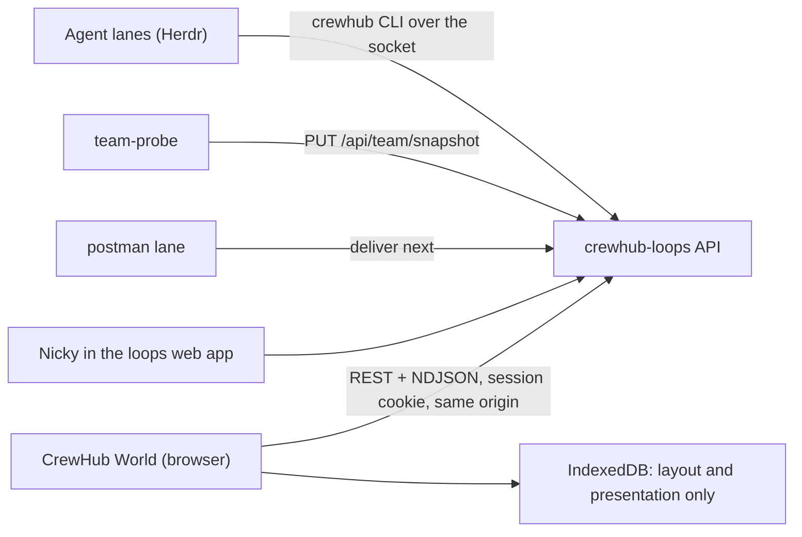

# CrewHub World on crewhub-loops: integration plan

Status: proposal for Nicky's review (2026-09-30). This document changes no code.
The accepted direction it answers is Nicky's instruction of 2026-09-30; the
decision record is [ADR 0005](decisions/0005-crewhub-world-on-loops.md).

Citations: `loops:<path>` is a file in the crewhub-loops repository at commit
`79ecfa0`; `v1:<path>` is a file in the CrewHub v1 repository (`crewhub`); plain
paths are in this repository. `loops:.../` abbreviates
`loops:services/api/src/crewhub_loops/`. The loops files are cited as code spans, not links,
because they live in another repository.

## 1. Summary and decision

crewhub-loops becomes the system of record and the driver for everything about
projects, tickets, agents, how agents work, how they talk to each other and how
people talk to them. CrewHub becomes **CrewHub World**: a browser client that reads
crewhub-loops and expresses what happens there as a 3D town. Every project is a
building, its lead agent sits at the centre of it, and tickets moving through
their statuses move agents between rooms. CrewHub keeps three jobs of its own:
dynamic pathfinding on the grid engine, a faithful visual language for every
fact crewhub-loops publishes, and props, including props people make themselves.
The bridge, the adapters, the session protocol and the Herdr-first direction are
removed. The world talks to crewhub-loops over its existing REST API and NDJSON
event stream, with the signed-in person's session and from the same origin. It
does not run a local relay around the `crewhub` CLI. The CLI remains the agents'
integration surface. The world observes the effects of CLI use through events
and uses the CLI itself for fixtures, tests and a later optional director lane.
Everything that makes the world move is deterministic by default. Optional
cheap-model behaviour is off unless it is switched on and has a budget.

## 2. What crewhub-loops is today

crewhub-loops is "the next-level inbox and ticketing for the ekinsol agent teams"
(`loops:README.md`). It is a FastAPI service with a React web app, SQLite and one
append-only event log. Agents reach it through a single-file CLI. A postman lane
(Claude Code on Haiku, `loops:docs/postman-briefing.md`) forwards deliveries into
agents' Herdr panes.

### 2.1 Domain model

| Entity | Key facts | Source |
| --- | --- | --- |
| Project | `slug`, `key` (ticket prefix), `name`, `lead` (one principal), `herdrSession`, `color`, `icon`, `counts` per status, `assigneeCounts`, archive state, root/extra folders, per-project features (`releases`, `milestones`, `watchdog_nudge`) | `loops:services/api/src/crewhub_loops/contracts/projects.py:39`, `domain/features.py:30` |
| Ticket | `key`, `title`, `kind` (task, feature, bug, question), `status` (backlog, planned, in_progress, review, done), `priority`, `assignee`, `waitingOn`, labels, `agentWorking`, `stall`, `waitingOnHuman`, `milestone`, `held`, `blocked`, `blockedBy`/`blocking`, `statusChangedAt`, archive and release refs | `loops:.../contracts/common.py:10`, `contracts/tickets.py:84-140` |
| Comment | threaded (`parentId`), by people or agents, `normal` or `system`; a person's comment on a Review ticket they wait on moves it back to In progress | `loops:docs/agents.md` ("Finishing a ticket"), `domain/comments.py:137` |
| Progress line | short status line on a ticket (`start`, `update`, `done`, `question`), source `herdr` (probe reads the pane status line every 30 s) or `cli`; rate-limited; workers write under their lead | `loops:docs/agents.md` ("Show progress"), `contracts/progress.py:10-35` |
| Milestone | per-project feature; `key` (`CL-M3`), `state` (planned, active, done, cancelled), `targetDate`, `owner`; hand-off to an agent creates one delivery per ticket | `loops:.../contracts/milestones.py:49-80`, `docs/agents.md` ("Milestones") |
| Release | per-project feature; draft made by a person, notes and tag by the lead, published only after a person's request; has a carrier ticket | `loops:docs/agents.md` ("Releases"), `docs/events.md` (CL-21) |
| Principal | `user` (person: admin or member), `agent` (role `lead`, `router`, `probe`) or `system` | `loops:.../contracts/common.py:14-18` |
| Agent | registered principal with `herdrSession`, `disabled`, `lastSeenAt`; with the global `agents_admin` feature also lanes, desired/observed model and effort, projects led and joined | `loops:.../contracts/auth.py:102`, `contracts/agents.py:22-100` |
| Worker | not registered: any Herdr agent `<stem>-<x>` in the session of the registered `<stem>-lead`; appears only in the team snapshot | `loops:docs/agents.md`, `docs/team.md` ("Lanes and workers") |
| Team snapshot | every Herdr session and agent with `status` (working, idle, done, blocked, unknown), `contextLine`, `paneId`, `lead`, `unsentInput`; pushed by `team-probe` every 30 s | `loops:docs/team.md`, `contracts/team.py` |
| Delivery | an event that concerns a principal becomes a delivery (`pending`, `claimed`, `forwarded`, `uncertain`, `unroutable`, `obsolete`), forwarded by postman as one line | `loops:.../contracts/common.py:19`, `docs/postman-briefing.md` |
| DM | a thread between a person (admin) and one agent; messages `queued`, `delivered`, `answered` | `loops:.../contracts/dm.py`, `api/routers/dm.py:69` |
| Watchdog state | per in-progress ticket: `stalled` (nobody attends it and nothing happened) or `attention` (nobody working and a lane blocked); "waiting on a human" suppresses it; modes `off`, `observe` (default), `nudge` | `loops:.../domain/watchdog.py:1-60`, `docs/deploy.md` ("Stall watchdog"), `contracts/tickets.py:41` |
| Link, attachment, label | typed links (GitHub PR, Linear, URL), attachments up to 20 MiB, project or global labels (`awaiting-deploy`, `release`, `smoke` reserved) | `loops:docs/agents.md` ("Ticket etiquette") |

### 2.2 Events and the stream

- One log, one envelope: `{v:1, seq, ts, type, project:{slug,key}|null,
  ticket:{id,key,title}|null, actor:{id,kind}, recipientIds, payload}`. Payloads
  carry ids and counts, never credentials or bodies (`loops:docs/events.md`).
  The ticket title is joined into the envelope (`loops:.../api/stream.py:127`).
- 49 event types, validated on the query (`loops:.../contracts/events.py`).
  The viewer-relevant ones are listed in 2.4.
- `GET /api/events?after=N` returns `{events, lastSeq}`. `GET /api/events/stream`
  is NDJSON. Without `after` it starts live at the tail. With `after=N` it replays
  `seq > N` and then goes live. There is a heartbeat every 15 s whose `seq` never
  runs ahead. The server ends every stream after 300 s and the client reconnects
  with the last seq. There is a cap of 4 streams per principal and 64 in total
  (429 otherwise). Credentials are revalidated every 60 s. A future retention
  limit will answer 410 `cursor_expired` (`loops:docs/events.md`).
- Filters: `project`, `types`, `for=me`. Visibility is enforced server-side:
  DM events reach only the thread's agent and admins, and agent-action events
  reach only participants and admins (`loops:.../api/stream.py:142-180`).
- `team.updated` has an empty payload. The client re-reads `GET /api/team`, and
  should poll it at least every 30 s (`loops:docs/team.md`).
- The loops web app already implements a follower in TypeScript: NDJSON parser,
  reconnect with `after`, 410 resync and a polling fallback
  (`loops:apps/web/src/api/stream.ts`). CrewHub World copies that pattern.

### 2.3 Auth, transports and the CLI

- One app, two listeners: a Unix socket (mode 0600) and TCP. TCP is exposed only
  through nginx at `127.0.0.1:8091/api`, and in production behind Tailscale Serve
  on port 9443 (`loops:docs/events.md`, `docs/deploy.md`).
- Principals come from the `chl_session` cookie (people; `SameSite=Lax`, path `/`)
  or `Authorization: Bearer chl_…` (agents). A valid key together with a cookie is
  refused (`loops:.../auth/deps.py:78-120`, `api/routers/auth.py:159-194`).
- A host/Origin guard checks both headers against `CHL_ALLOWED_HOSTS` and
  `CHL_ALLOWED_ORIGINS`. There is **no CORS middleware**: a page on another origin
  gets no `Access-Control-Allow-*` headers (`loops:.../api/security.py:56-81`).
  Dev already allows `http://127.0.0.1:5173` (`loops:compose.dev.yaml:9`).
- The `probe` agent role may only read and PUT the team snapshot, inputs and
  runtime observations. There is no read-only role for any other client
  (`loops:.../auth/deps.py:139-172`).
- OpenAPI is switched off (`docs_url=None`, `openapi_url=None`,
  `loops:.../api/main.py:123-125`). Only the team snapshot has a published JSON
  schema (`loops:docs/team.schema.json`).
- The CLI `crewhub` (`loops:clients/crewhub.py`, stdlib only) is the agents'
  interface. It runs as one agent (`CREWHUB_AGENT`), reads a 0400 key file from
  `/etc/ekinsol/secrets/crewhub-loops/` on every call and speaks HTTP over the
  socket. Its read commands are agent-shaped: `me`, `queue`, `ticket show`,
  `ticket comments`, `project show SLUG`, `milestone list/show/tickets`,
  `release show/list`, `dm list/read`, and `watch --json` with a per-label cursor
  file. It has **no** command for the project list, the board, the team
  snapshot, the agent list or the watchdog (`loops:clients/crewhub.py`, subcommand
  list; `docs/events.md` "CLI").
- agentctl (`loops:clients/crewhub_agentctl.py`, `docs/agents-agentctl.md`) is the
  only code that starts, exits or restarts lanes. It works through Herdr under a
  fenced lease, and only for confirmed agent actions. It is not a viewer concern:
  the world sees its outcome as `team.updated` and `agent-action.updated`.

### 2.4 What a viewer needs

| World need | Endpoint (initial load) | Events (live) | Who may read |
| --- | --- | --- | --- |
| Buildings | `GET /api/projects` | `project.created/updated/archived/restored/reordered` | any principal |
| Lead and members | `GET /api/projects/{slug}`, `GET /api/agents` | `agent` changes arrive as `team.updated` or project updates | any principal |
| Tickets per room | `GET /api/board/{slug}` (columns of cards) | `ticket.created/updated/moved/archived/unarchived` | any principal |
| One ticket's detail | `GET /api/tickets/{ref}`, `/comments`, `/progress` | `comment.*`, `link.*`, `attachment.added`, `ticket.progress` | any principal |
| Presence and posture | `GET /api/team` | `team.updated` (payload-free), plus polling every 30 s | any principal |
| Stalls | card `stall`, `GET /api/watchdog` | `ticket.stalled`, `ticket.resumed` | watchdog route: admin or agent |
| Deliveries | none for a person (`GET /api/deliveries` is router/operator only) | `delivery.created/updated` with `recipientIds` | any principal (envelope only) |
| DMs | `GET /api/dm/threads` | `dm.created`, `dm.answered` | admin or the thread's agent |
| Milestones, releases | `GET /api/projects/{slug}/milestones`, `/releases` | `milestone.*`, `release.*` | any principal, feature on |

## 3. Target architecture

**Source of truth.** crewhub-loops owns every fact: projects, tickets, agents,
presence, deliveries, messages and watchdog states. CrewHub World owns only where
things stand and how they look: building plots, room modules, prop placements,
prop definitions made by the user, camera and presentation preferences, and the
AI-presence settings. It never stores ticket text, comments, messages or
credentials. It never writes a copy of a fact that it could read again.

**Data flow.**

1. Initial load, stream first. Open `GET /api/events/stream` without `after`, which
   starts live at the tail (`loops:.../api/routers/events.py`, `current_tail`), and
   buffer what arrives. Then read `/api/projects`, `/api/team` and one
   `/api/board/{slug}` per non-archived project, in parallel. Then apply the
   buffered events. Nothing that happens during the load is lost, and applying an
   event is idempotent, so an event the load already reflected does no harm.
   The cursor is the seq of the last line received (an event or a heartbeat).
   `GET /api/events` is not usable for taking a cursor: with a full page, its
   `lastSeq` is the last row, not the tail.
2. Live: `GET /api/events/stream?after=<lastSeq>`. Each envelope patches a
   normalised store keyed by loops ids (`tk_…`, principal id, slug). Where the
   payload is too thin (for example `ticket.updated` names the changed fields but
   not their values), the client re-reads that one ticket, coalescing bursts
   within 250 ms. On `team.updated`, and every 30 s, it re-reads `/api/team`.
3. Reconnect: after the server's 300 s end, reconnect at once with the last seq
   (a heartbeat's seq counts). A stream that ended before its first line gives no
   cursor: reload. After an error, back off from 1 s to 30 s. On a 410,
   discard the store and reload. On a 401, show "signed out" and offer the loops
   sign-in, keeping the last state visibly stale. One tab per browser holds the
   stream and shares it with the other tabs over `BroadcastChannel`, which stays
   within the 4-streams-per-principal cap.
4. Rendering never waits on the network. The store emits one coalesced change
   per frame budget, and the scene reads it.

**Auth for the browser.** The world uses the person's own loops session. It is
served from the same origin as the loops web app (for example `/world/` behind
the loops nginx or a Tailscale Serve path), so the `chl_session` cookie is sent,
the Origin guard passes and no CORS is needed. In development, Vite proxies `/api`
to a local loops (`make dev` or `make up` in crewhub-loops); the dev origin
`127.0.0.1:5173` is already on the dev allowlist. Agent keys never enter the
browser. That follows loops' own rule (a key never appears in argv, a URL, env or
a log; `loops:docs/events.md` "CLI") and this repository's rule against secrets in
browser storage ([ARCHITECTURE.md](ARCHITECTURE.md), "Local access and reuse").
Visibility then equals what the person may see in the loops web app, DMs included.

**Why not a local relay around the CLI.** Nicky asked for an honest comparison
of two options: (A) a small host process that uses the CLI or the socket and
relays to the browser, and (B) the browser reading crewhub-loops directly.

| Question | A: host relay over CLI or socket | B: browser reads loops directly (recommended) |
| --- | --- | --- |
| Where it runs | On the loops host, because the socket (`/run/crewhub-loops/api.sock`) and the key files are there. Nicky's browser runs on a different machine, so the relay needs its own HTTP listener, TLS or Tailscale exposure, Origin checks and pairing: the bridge again, under a new name. | Nothing new runs. The static bundle is served next to the loops web app. |
| Identity | The relay is an agent (a key file of its own). Everything it does is attributed to that agent, not to Nicky. It can see what agents see, including chat it should not show a person, unless it re-implements loops' visibility rules. | The person's session. loops applies its own visibility (DMs, agent actions) and attributes any later write to the person. |
| CLI fit | The CLI is agent-shaped (`me`, `queue`, `--for me`) and has no command for projects, the board, the team or agents. The relay would bypass it and call the socket anyway, so "using the CLI" would be nominal. `watch --json` fits well. | Uses the same REST and stream contracts the CLI uses underneath. |
| Latency | One extra hop and a second stream. Negligible on one host, but the relay's own reconnect and fan-out add failure modes. | One hop through nginx, which is already unbuffered for the stream (`loops:infra/nginx.conf:18-31`). |
| Shell size | A new service to build, deploy, secure, monitor and keep in sync with the loops API. This contradicts "keep the shell as small as possible". | Only a TypeScript client module inside `apps/world`. |
| What loops must change | Nothing on the API. A key, a role and a systemd unit for the relay. | A same-origin mount (or CORS) and a sign-in `next` path; see section 9. |

Recommendation: B. The CLI stays first-class for what it is for. Agents change
the world by using it: every `crewhub ticket move`, `progress`, `comment`,
`wait` and `done` becomes an event that the world animates. The world layer uses
the CLI in three places, none of them at runtime in the browser:

| CLI command | Used by the world layer for |
| --- | --- |
| `crewhub watch --json --label world-fixture [--project SLUG] [--types …]` | Recording real, redacted event fixtures for the replay demo and for tests (the cursor file makes recordings resumable). |
| `crewhub ticket new/move/assign/wait/done/progress/comment`, `crewhub milestone ticket new` | Driving a dev loops instance in acceptance tests and demo scripts, so what the world shows is caused by the real agent path. |
| `crewhub project show SLUG --json`, `crewhub milestone list --json`, `crewhub ticket show REF --json` | Cross-checking fixtures against the API while testing. |
| Proposed `crewhub world …` (section 7, phase 6) | The optional director lane and agents' own awareness, both through the CLI with their own keys. |

## 4. The world mapping

### 4.1 Town and buildings

- **Town:** one per crewhub-loops installation. Plot order follows the loops
  project order (`project.reordered`). The user can move plots, and that change
  stays local.
- **Building:** one per non-archived project. The sign shows `name` and `key`;
  the loops `color` and `icon` choose the facade trim and the emblem. An archived
  project's building is boarded up (`project.archived`). It stays in place
  until the user removes it, and comes back on `project.restored`.
- **Town square and post office:** shared places. The post office is the
  postman's home and the starting point of every delivery walk. Registered
  agents that lead no project (in the seed: `analyst`, `ux-lead`, `gads-lead`,
  `fm-lead`, `tools-lead`, `ted`; compare `loops:config/agents.yaml` with
  `loops:config/projects.yaml`) work from a "town hall" (a cosmetic placement;
  see 4.5). The seed files only bootstrap; the database is the truth.

### 4.2 Room conventions per building

Rooms follow the ticket workflow, because every project has that workflow and
it changes constantly. Milestones are an optional per-project feature, so they
group work within rooms instead of creating rooms of their own.

| Room | Exists when | Contents (facts) | Grows with |
| --- | --- | --- | --- |
| Lobby | always | project sign, counts per status (`counts`), the mailbox (deliveries to this project's agents), a waiting bench for people named in `waitingOn` | never |
| Lead's office | always, at the centre of the building | the lead's desk, its current in-progress tickets as folders, a DM phone (admins only) | never |
| Planning room | always | wall board with `planned` tickets (next up), `backlog` as a shelf of crates; `held` milestone tickets as sealed crates | board length with planned count |
| Workshop | always | one workstation per `in_progress` ticket; the assignee, or the lead and its workers, work there; a `blocked` ticket's station is roped off | 4 × 4 modules per extra group of workstations (the [TOWN_PLAN](TOWN_PLAN.md) capacity rules) |
| Review room | always | `review` tickets on a long table; tickets `waitingOnHuman` get a lit "waiting on <person>" lamp | table length |
| Meeting room | on first use | see 4.3; empty otherwise | never |
| Release hall | `releases` feature on | release drafts, the carrier ticket, a banner on `release.published` | never |
| Archive | first archived ticket | shelves with archive batches (`batchId`, counts only) | shelf modules |

Milestones: when the feature is on, each active milestone gets a coloured
banner, and its workstations and planning-board slots take that colour. A
milestone never moves a ticket to another room. Done tickets leave the workshop.
They stay visible as small "done" trays in the review room until they are
archived. **Done is set by a person** (`loops:docs/agents.md`, "Finishing a
ticket"), so the completion celebration plays only on `ticket.moved` to `done`
with a person as actor.

### 4.3 Where agents are and how they move

The lead is always in its building, and its home cell is the office desk. The
seed config gives each lead one project (`loops:config/projects.yaml`), so a lead
has one building. If a lead ever leads several projects, its avatar lives in the
building of its most recent activity, and the other buildings show its office
with a lit "away at <building>" placard (open question Q4).

| Trigger (fact) | Movement or posture (presentation) |
| --- | --- |
| `ticket.moved` to `in_progress`, assignee is an agent | The assignee walks from its office or the planning board to a free workstation and sits. |
| `team.updated`: agent `working` | Focused work animation at its station, or at the office desk if it holds no in-progress ticket. |
| agent `idle` or `done` | Relaxed posture at its home place. Herdr's `done` is never shown as task success. |
| agent `blocked` | A raised-hand posture and a text label "blocked". |
| agent `unknown`, or the snapshot older than 5 minutes | Greyed out, labelled "status unknown" or "stale since <time>". |
| worker `<stem>-x` appears in the snapshot (`lead` field) | A small helper spawns at the lobby door and walks to its lead's station, or to the station whose key is in its `contextLine`. It leaves when it disappears from the snapshot. |
| `ticket.moved` to `review` | The worker carries a folder to the review table and returns. |
| `ticket.moved` from `review` to `in_progress` with `reason: review_reply` | The person's comment pulls the folder back to the workstation. |
| `ticket.progress` | A short caption above the agent (the line itself, at most 200 characters, `kind` as an icon), fading after 20 s; `question` stays until the next line. |
| `comment.created` | A speech mark (without text: payloads carry no bodies) over the author, or over the waiting bench if the author is a person. Selecting it opens the thread, fetched with the person's session. |
| Two or more principals comment on one ticket within 10 minutes, or a lead and a worker both report its key | Inference: they meet in the meeting room with the ticket on the table. Labelled "discussing CL-12". |
| `delivery.created` | The postman avatar (the real `postman` agent) walks a letter from the post office to the recipient's building mailbox. On `delivery.updated` → `forwarded` it is handed over. `uncertain` or `unroutable` leave a red-flagged letter at the mailbox. |
| `dm.created` / `dm.answered` (admins only) | The lead's DM phone rings; answered clears it. |
| `ticket.stalled` (`stalled`) | The station's lamp dims and a quiet-clock shows "quiet 47 min"; nudges increment a small counter. |
| `ticket.stalled` (`attention`) | An amber beacon over the lead's office: "attention: cl-dev-3 blocked 12 min". |
| `ticket.resumed` | Lamp and beacon clear; the resolution (`activity`, `attending`, …) shows once as a toast. |
| `release.published` | A short banner and confetti in the release hall. |

Offscreen buildings keep semantic state and move actors straight to their
destination without cosmetic walking ([TOWN_PLAN.md](TOWN_PLAN.md), section 9).

### 4.4 People

People are not avatars that wander. A person appears as a visitor at a
building's lobby when a ticket there waits on them (`waitingOn` of kind `user`),
labelled "waiting on Nicky (3)". When a person acts (a comment or a move), a
brief visitor animation plays at the relevant room. The world never shows
whether a person is online, because loops does not publish that.

### 4.5 Facts versus inferences

The rules in [VISUAL_DIRECTION.md](VISUAL_DIRECTION.md) apply unchanged: no
invented tool calls, progress percentages or results, and idle is not success.

| Shown | Kind | Basis |
| --- | --- | --- |
| Ticket in a room, stall, attention, waiting on a person, blocked, delivery state | fact | loops fields and events |
| Agent working/idle/blocked | fact with a freshness | team snapshot, 30 s cadence; stale after 5 minutes |
| Which workstation a worker uses | inference, labelled | key in `contextLine`, same rule loops uses for progress (`loops:docs/agents.md`) |
| Meeting | inference, labelled | the comment/worker co-activity rule in 4.3 |
| Walking paths, idle wandering, where an idle agent sits | cosmetic | engine and optional AI behaviour (section 7); never presented as work |
| Town hall residents | cosmetic placement | agents that lead no project |

Every fact shown in the scene is also available as text: a building summary
panel, a selected agent's card and an accessible list view. None of them is
signalled by colour alone. The colours are the loops status tokens chosen by the
design-system work (`progress`, `attention`, `done`, `stalled`, `planned`).

## 5. Pathfinding and the grid engine

**What exists** (`packages/world-engine/src/index.ts`,
[GRID_ENGINE.md](GRID_ENGINE.md)): one rectangular grid of at most 128 × 128 cells;
rotated rectangular footprints; static occupancy; four-way A* with an open-list
scan (quadratic in the worst case); actor reservations of the current and next
cell; atomic placement with reachability checks; replanning of every actor after a
placement; and semantic snapshots. It has no doors, no multi-room or town routing,
no heap and no deadlock handling.

**What dynamic pathfinding needs, in order:**

1. **Room graph per building.** Each room keeps its own interior grid, with
   door cells on its edges. Doors are portals between two rooms' door cells. A
   route runs in two layers: a portal-graph search (Dijkstra, a few dozen nodes)
   across rooms, then local A* inside each room, one leg at a time. A leg is
   planned only when the actor reaches its door, so later rooms can change in
   the meantime without invalidating the whole route.
2. **Town layer.** Building entrances become portals on the town grid (paths
   between plots). The postman and cross-building walks use the same two-layer
   search. Stairs or lifts between floors are also just portals with a cost, so
   floors can be added later without a new planner.
3. **Moving obstacles.** Keep exclusive reservations. Add a wait budget: an
   actor that waits more than 1.5 s replans once, treating reserved cells as
   expensive instead of forbidden. After 5 s the lower-priority actor steps
   aside to a free neighbouring cell. Door cells are single-occupancy with a
   short queue, which removes most corridor deadlocks.
4. **Recompute triggers.** Replan only when the layout revision changes (a
   prop placed, a room grown, a door added), when the destination changes (an
   event), or when the wait budget above runs out. Never per frame. Coalesce a
   burst of events into one replan per affected room per tick.
5. **Performance.** Replace the open-list scan with a binary heap before rooms
   exceed about 32 × 32. Cache portal-to-portal distances per room revision.
   Offscreen buildings do not route cosmetically (section 4.3).

The rule "geometry is registered separately from semantics and never inferred
from meshes" stays ([AGENTS.md](../AGENTS.md)).

## 6. Props

### 6.1 What v1 teaches

CrewHub v1 had a rich prop system. The ideas are worth keeping, but not the code:

- **Props as data, rendered by one component.** A user prop is a list of
  primitive parts (`box`, `cylinder`, `sphere`, `cone`, `torus` with position,
  rotation, size, colour and an emissive flag), drawn by one generic component.
  No generated code runs (`v1:frontend/src/components/world3d/zones/creator/DynamicProp.tsx:7-14`).
  AI generation asked for TSX *and* a parts block, but only the parts were
  rendered (`v1:docs/features/creative/creator-zone/creator-zone-prompt.md`).
- **One registry with namespaced ids** for built-ins, user props and mods
  (`builtin:`, `custom:`; `v1:frontend/src/lib/modding/registries.ts`).
- **Keyboard-first placement editing**: select, drag or arrow keys, R to rotate,
  Enter or Esc, Delete, and a 50-step undo
  (`v1:frontend/src/hooks/usePropMovement.ts:454-495`,
  `v1:frontend/src/components/world3d/zones/creator/CreatorModeContext.tsx`).

And what to avoid:

- **Two placement systems.** v1 had grid blueprints next to free `placed_props`.
  The free props never blocked pathfinding, and their 0.5 snap did not match the
  0.6 cell (`v1:frontend/src/components/world3d/Bot3D.tsx:137-146`).
- **Custom props without footprint or rotation**
  (`v1:frontend/src/components/world3d/props/custom/index.ts:49`).
- **Placements identified by `(propId, x, z)`**, and edits written into
  source JSON (`v1:backend/app/routes/blueprints.py:625-701`).
- **AI generation without any budget**, where the model choice was ignored
  (`v1:backend/app/services/creator/prop_stream.py:167-180`).
- **Generated props looked lifeless** next to the hand-made ones
  (`v1:docs/features/creative/prop-maker-improvements/analysis.md`).

### 6.2 The prop model in CrewHub World

- **Semantics first, looks second** (the grid rule). A prop is two records under
  one namespaced id (`builtin:desk`, `user:<uuid>`):
  - the engine's `PropDefinition`: footprint, `blocksMovement`, tags, approach
    cells. This alone drives occupancy and routing.
  - a `PropVisual`: either a built-in renderer factory, or a validated parts
    list whose bounds must fit the footprint plus a small decorative overhang.

  Changing the visual never changes navigation.
- **Catalogue.** Built-ins ship with the app, grouped by category and tags
  (work, rest, gather, storage, greenery, light, decoration). User props sit in
  the same catalogue under "Mine". They are stored in the local `TownDocument`
  and can be exported and imported as JSON. They move to crewhub-loops only if
  L7 is accepted.
- **Making props.** The primary route is a deterministic in-app parts editor:
  add a primitive, move, rotate and scale it on a grid snapped to the cell size,
  pick a material from a fixed palette, and declare the footprint. It costs
  nothing. The second route is importing a parts-JSON file. For example, a
  person asks any agent through a loops ticket to design one, and the agent
  attaches the JSON. Any model cost is then the agent's normal usage, within
  crewhub-loops. The world gets no model path of its own for props.
- **Placement.** There is one system: engine-validated placement on the room
  grid, with stable instance ids, undo and the existing reachability rules. No
  free placement.

### 6.3 Props attached to loops entities

A placed prop may carry an attachment: `{kind: "room" | "agent" | "ticket" |
"project", ref: <loops id>}`.

| Attached to | Behaviour |
| --- | --- |
| Room or project | Ordinary furniture; the default. |
| Agent | A personal item, placed at the agent's home place (office desk for a lead) or carried as a footprint-free accessory. It follows the agent to another building. |
| Ticket | Occupies a decoration slot of the workstation or review-table place that holds the ticket, and moves with it between rooms. When no slot is free, it waits on a lobby shelf with a text label. |

Rule props are attachments made automatically from facts, and they are shown as
such. Examples: a rocket crate for the `awaiting-deploy` label, a jar for `bug`
tickets, a trophy on the lead's desk per published release. They are
deterministic and editable in a rules table. Workstation templates reserve
decoration slots, so an attached prop never makes a placement invalid.

## 7. Agent presence and AI-driven behaviour

**Deterministic layer (always on, zero cost).**
- The place and posture of every agent follow from facts, as in 4.3.
- Before a status may retarget movement, it must hold for two consecutive
  snapshots, or for 45 s. v1 removed its desk-walking because flickering status
  kept resetting targets and caused jitter
  (`v1:frontend/src/components/world3d/JITTER_ANALYSIS.md`).
- An agent at rest gets small idle variety from a seeded choice of prop-tagged
  actions (look at the board, water a plant, stretch, visit the kitchen), keyed
  by agent id and time bucket. Reload shows the same behaviour.
- This layer respects reduced motion and pauses in hidden tabs.

**Agent awareness (no pushed calls).** An agent can learn that it is "there"
without any extra prompt. The proposed `crewhub world where` (L8) answers in
about 40 tokens: "You are in the Workshop of crewhub-loops at the CL-12 station;
nearby: cl-dev-3; the lobby has 2 letters for you." It uses zone labels, not
coordinates, as v1's unbuilt spatial-awareness design suggested
(`v1:docs/features/3d-world/spatial-awareness/spatial-awareness-design.md`).
Agents run it only if they choose to. One optional line in the loops briefing
snippet tells them it exists. Nothing is ever sent into a lane.

**Optional AI layer: the director (off by default).** A dedicated Claude Code
lane on the cheapest model, following the postman pattern: Haiku 4.5
(`claude-haiku-4-5-20251001`) at low effort, with its own agent key under the
`viewer` role (L6) and a write scope for world intents only (L7).
- **Input.** On a timer, it reads a compact world summary through the CLI:
  rooms, the tags of reachable props, and the idle agents with their zone. It
  never reads ticket bodies, comments or DMs.
- **Output.** It chooses from a closed list of cosmetic actions per idle agent:
  go to a prop by tag, visit an agent, stay. The engine validates each choice.
  An invalid choice is dropped.
- **Limits.** It never moves a working, blocked, stalled or waiting agent, and it
  never produces free text that appears as an agent's speech.

| Setting | Default | Bound |
| --- | --- | --- |
| `presence.ambient` (deterministic idle variety) | on | off / reduced / on |
| `presence.director.enabled` | **off** | global kill switch in the world settings and the lane's own stop |
| `presence.director.model` | `claude-haiku-4-5-20251001` | never escalates to a larger model |
| Interval per building | 10 min | minimum 5 min; only buildings with idle agents |
| Calls per hour / per day | 6 / 60 | hard stop at the cap; the counter is visible in the world |
| Input / output tokens per call | 1,500 / 150 | truncate input and refuse over-length output |
| Runs only while watched | yes | a world tab has sent a heartbeat within 2 minutes (L7) |

At the defaults the ceiling is 60 × 1,650 ≈ 100k tokens a day. The currency
cost is shown only once real pricing and usage are available, as
[COST_POLICY.md](COST_POLICY.md) requires. The trigger, cache key (building
revision plus idle set), cancellation (the kill switch, or stopping the lane)
and usage report are defined before phase 6 starts. With the director off, the
world is fully functional.

## 8. What is removed and what stays

**Removed from crewhub2:**

| Item | Reason |
| --- | --- |
| `apps/bridge` (README only) | crewhub-loops is the service; nothing in the world needs machine access. |
| `packages/protocol` (`SessionSummary`, `SessionSnapshot`, `SessionStatus`) | Replaced by a `packages/loops-client` with the loops read models, the envelope and runtime validation. |
| Mock crew, scenarios and `demoSnapshot` in `apps/world/src/world/data.ts`, and the "simulated reply" UI in `App.tsx` | They pretend to be a runtime. Replaced by a clearly labelled **replay** mode that plays recorded, redacted loops event fixtures, so demo mode still needs no account (a [VISION.md](VISION.md) requirement). |
| Herdr, Claude Code and Codex adapter milestones (M5 to M7 in [ROADMAP.md](ROADMAP.md) and [TOWN_PLAN.md](TOWN_PLAN.md) section 7) | Herdr stays behind crewhub-loops (probe, postman, agentctl). The world never talks to it. |
| Canonical runtime sessions, source observations and command routes ([ADR 0003](decisions/0003-towns-and-session-bindings.md), [TOWN_PLAN.md](TOWN_PLAN.md) section 3) | Identity is the loops principal id; a worker is identified by session and Herdr name, as in `/api/team`. |
| Tauri companion plans | No local machine access is needed. |

**Stays:** `packages/world-engine` (extended as in section 5); the renderer,
models and shaders in `apps/world/src/world` and `WorldCanvas`; the Greenhouse
art direction for interiors; town plots, two grids, stable growth and detail
levels from [TOWN_PLAN.md](TOWN_PLAN.md) sections 4, 5 and 9; the cost policy; and
the crewhub-loops design system and kit adopted by ADR 0004
(`docs/decisions/0004-loops-design-system.md` on the `feat/loops-design-system`
branch). The world UI uses its tokens and its five primitives, and follows its
status mapping.

## 9. Proposals for crewhub-loops

Each item is a proposal for the crewhub-loops repository, in priority order.

| # | Proposal | Reason | Needed by |
| --- | --- | --- | --- |
| L1 | Serve CrewHub World from the loops origin: an nginx `location /world/` for a static bundle (or a Tailscale Serve path mount), plus the world origin in `CHL_ALLOWED_ORIGINS` if it ends up on its own origin | The session cookie and Origin guard work unchanged; no CORS layer, no keys in the browser. | Phase 1 in production (dev works through the Vite proxy) |
| L2 | Sign-in accepts a same-origin `next` path (`/login?next=/world/`) | Today the login page returns only to a router-state `from` (`loops:apps/web/src/pages/Login.tsx:17`), so a world outside the SPA cannot send the user back. | Phase 1 |
| L3 | Publish JSON Schemas (or generated TypeScript types) for `Envelope`, `ProjectOut`, `TicketCard`, `BoardResponse`, `TeamSnapshot`, `MilestoneSummary`, as already done for `team.schema.json`, with a drift test | OpenAPI is disabled (`loops:.../api/main.py:123-125`); the world must validate network input at runtime ([AGENTS.md](../AGENTS.md), protocol rule). | Phase 1 (hand-written validators until then) |
| L4 | `TeamAgent.ticketKey` (derived, nullable): the in-progress ticket a lane or worker is on, using the server's existing key rule | The server already credits workers to tickets (`loops:.../domain/progress.py`); re-parsing `contextLine` in the browser duplicates a rule that can drift. | Phase 2 |
| L5 | `ticket.updated` payload: include new `assigneeId` and `waitingOnId` when those changed | Saves a ticket re-fetch for the two changes that move agents. | Phase 2 (optional) |
| L6 | A read-only agent role `viewer`: safe methods only, no writes at all, no DM or agent-action visibility | For a wall display or kiosk without a person's session, and for the director lane in phase 6. Today only `probe` is read-mostly, and it may write the team snapshot. | Phase 6, or a kiosk |
| L7 | Server-side world document: `GET/PUT /api/world/layout` (one JSON document, revision compare-and-swap, size cap, no facts inside) and a `world.updated` event | Only if Nicky wants layouts to follow him across devices, or several people to share one town, or the director lane to publish intents. Local IndexedDB is enough before that. | Phase 4b or 6 |
| L8 | `crewhub world where|intents` CLI commands on top of L6/L7 | The agent-facing half of section 7: an agent or the director reads where it "is" through its normal tool. | Phase 6 |

Not needed: new event types for ordinary work (the 49 existing types cover it),
CORS (with L1), and any change to postman or agentctl.

## 10. Phases

Each phase is usable on its own. All phases keep `npm run check` green and make
zero model calls unless phase 6 is switched on.

| Phase | Deliverable | Acceptance criteria |
| --- | --- | --- |
| 1. First light | `packages/loops-client` (typed fetch, runtime validation, stream follower with `lastSeq`, 410/401 handling, BroadcastChannel sharing); Vite proxy to a local loops; the town shows one plain building per project with name, key and status counts, and each lead standing in its building with its team status | With crewhub-loops `make dev` and its seed, `crewhub ticket move CL-1 in_progress` (as `cl-lead`) changes that building's counts within 2 s; stopping and restarting the loops API recovers without a reload; a 300 s stream end reconnects without replaying seen events; nothing is written to loops; the old mock remains available behind a "replay" toggle |
| 2. Building interiors | The room conventions of 4.2; workstations per in-progress ticket; agent and worker movement from 4.3 inside one building; stall, attention, waiting-on-human, progress captions; text panels for every fact. Remove `apps/bridge`, `packages/protocol`, the mock crew and scenarios; add recorded replay fixtures | A scripted run of CLI commands (new, move, progress, wait, done, comment) produces the expected sequence of rooms and postures in a recorded test; a stale snapshot is shown as stale; every scene state has a text equivalent |
| 3. Town and dynamic pathfinding | Portal graph, doors, town paths, postman deliveries between buildings, wait budget and step-aside, heap A*, detail levels with one detailed interior at a time | 12 buildings and 100 agents from a replay fixture stay within the 33 ms frame budget on the reference device; no actor waits more than 5 s in the corridor stress test; offscreen buildings do no cosmetic routing |
| 4. Layout and props | Local `TownDocument` in IndexedDB (plots, modules, placements, user props), export/import and undo; prop catalogue, prop editor and attachments (section 6) | Reload restores the same town; an invalid import leaves the previous revision intact; a user-made prop blocks exactly its declared footprint; attached props follow their ticket between rooms |
| 5. Talking through loops | From the world, with the person's session: open a ticket in the loops web app, comment on a ticket, reply in a DM thread (admins), quick-ask a building's lead | Every write goes to a loops endpoint and appears as its normal event; nothing is sent to Herdr from the world; a failed write is shown and never retried blindly |
| 6. Optional AI presence | The director lane and settings of section 7, with L6 to L8 in crewhub-loops | Off by default; with it on, calls stay within the configured budget; a usage counter is visible; switching it off stops calls within one interval |

## 11. Risks and open questions

Risks:

- **Stream and team cadence.** Presence is at best 30 s fresh, so the world
  moves in steps, not continuously. Mitigation: ease transitions and label
  freshness; never animate "working" from a stale snapshot.
- **Thin payloads.** Some events need a re-fetch. Coalescing bounds the load,
  but a release archive of 200 tickets is 200 events (one per ticket, shared
  `batchId`, `loops:docs/events.md`). Fold batches client-side.
- **Two repos, one contract.** Until L3 lands, the world validates against
  hand-written schemas that can drift. Pin a loops commit in the client and
  run a fixture test against it.

Open questions for Nicky:

- Q1. Should the world be served under the loops origin (`/world/`, L1)? That is
  the recommendation. The alternative is a separate origin with CORS.
- Q2. Rooms by ticket status (recommended) or rooms by milestone? Milestones are
  a per-project feature and off by default.
- Q3. Is local-only layout storage acceptable for now (phase 4), with the
  server-side world document (L7) only when you want it on several devices?
- Q4. May a lead ever lead several projects? If so, confirm the "away at"
  placard rule in 4.3.
- Q5. For phase 6: is a dedicated Haiku director lane (like postman) the right
  home for AI movement, and what monthly budget is acceptable?

## 12. Sentences to change once this plan is accepted

This plan leaves these files untouched. After acceptance, the following
sentences change. Line numbers refer to `main` at `77c5db7`. The design-system
branch separately rewrites the design paragraph of `AGENTS.md` (lines 14-17) and
parts of `VISUAL_DIRECTION.md`. Neither of those overlaps with the list below.

**[AGENTS.md](../AGENTS.md)**

| Line | Current sentence | Becomes |
| --- | --- | --- |
| 5-6 | "Build CrewHub as a delightful browser world connected to existing agent runtimes through a reusable bridge." | A delightful browser world that shows what happens in crewhub-loops. |
| 12-13 | "The user has now accepted the room's visual direction and requested a town plan: … M2 onward is proposed implementation work." | Points to this plan and its phases. |
| 39-40 | "Keep Tauri APIs, filesystem access, process execution, provider credentials, and runtime-specific control logic out of it." | Keep credentials, keys and machine access out of it; all data comes from crewhub-loops through `packages/loops-client`. |
| 41-43 | "`apps/bridge` is the future independent service. … Rust is the intended starting point, …" | Removed. |
| 44-45 | "`packages/protocol` stays free of React, Three.js, Tauri, and runtime dependencies. Its bootstrap types are provisional; …" | The same rule for `packages/loops-client`, with runtime validation of every loops response. |
| 49 | "Herdr comes first. Add direct runtime adapters only for a concrete missing need." | crewhub-loops is the only source of facts; the world never talks to Herdr or to a runtime. |
| 50-51 | "Keep mock activity explicitly labeled. Never imply that fixture data describes a real running session …" | The same rule for replay fixtures of recorded loops events. |

**[VISION.md](VISION.md)**

| Line | Current sentence | Becomes |
| --- | --- | --- |
| 27 | "Reuse existing sessions and harnesses, beginning with Herdr." | Show the crew as crewhub-loops knows it. |
| 28 | "Put machine access in an independent bridge that other applications can use." | crewhub-loops is the service; CrewHub World is a client of it. |
| 33-34 | "Use a CrewHub town as a work context, with persistent rooms and capacity that grows with usable workstations. Herdr can supply the initial hierarchy." | Every project is a building; rooms follow the ticket workflow and grow with the work. |
| 35-36 | "Allow Claude Code and Codex sessions to join directly and share rooms, with one canonical identity …" | Removed: identity is the loops principal. |
| 44-45 | "For the first visual milestone, all activity is simulated … Later, one live Herdr session drives the same experience." | A live crewhub-loops drives the world; a labelled replay works without an account. |
| 51-52 | "A subsequent live adapter can replace the mock source without redesigning the world." | Removed (done by phase 1 and 2). |

**[ARCHITECTURE.md](ARCHITECTURE.md)**

| Line | Current sentence | Becomes |
| --- | --- | --- |
| 5-7 | "Keep the visual experience browser-first and the machine bridge independently usable. Tauri is an optional packaging and desktop-integration layer. …" | Browser-first client of crewhub-loops; no bridge, no Tauri. |
| 10-12 | "The accepted next direction adds CrewHub-owned towns, dynamic rooms, and bindings to runtime sessions." | Towns and rooms are CrewHub's; every fact is crewhub-loops'. |
| 17-26 | The diagram with Bridge, Herdr adapter and direct adapters | The diagram of section 3. |
| 30-37 | Table rows "Bridge", "Adapter", "Protocol", "Tauri companion" | Rows "loops client" and "crewhub-loops (external)". |
| 45-46 | "Rust is the intended bridge starting point; …" | Removed. |
| 50-55 | Integration order 1-5 | The phases of section 10. |
| 57-60 | "Browser clients cannot directly open Herdr's Unix domain socket … The bridge provides that local access. …" | The same-origin session access of section 3, and why not a CLI relay. |
| 64-76 | Session identity and command ownership | Identity is the loops principal id; commands are loops writes with the person's session (phase 5). |
| 80-88 | Events and reconnection against Herdr | The loops stream contract: `lastSeq`, 300 s end, heartbeats, 410 resync. |
| 92-100 | Loopback pairing, remote access across Tailscale | Session auth, Origin guard and Tailscale Serve, all as deployed by crewhub-loops. |
| 104-108 | Primary references (Herdr, Tauri, Codex App Server, Claude SDK, MCP) | `loops:docs/events.md`, `loops:docs/team.md`, `loops:docs/agents.md`. |

Other documents that this plan supersedes in part, and that should say so at
the top once it is accepted: [ROADMAP.md](ROADMAP.md) (M5 to M7), [TOWN_PLAN.md](TOWN_PLAN.md)
(sections 2, 3, 7 and 8), [ADR 0003](decisions/0003-towns-and-session-bindings.md)
(the runtime bindings), and the ARCHITECTURE row of [docs/README.md](README.md).
